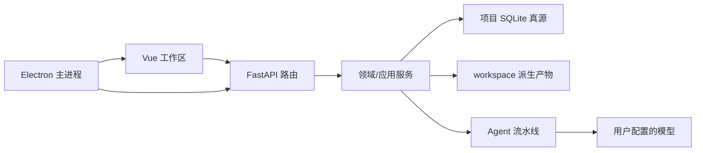

# 栖墨 V2 项目指南

> 更新：2026-07-27。本文描述当前 V2，不承担历史版本迁移说明。

## 产品定位

栖墨是本地优先的长篇小说生产工作台。FastAPI 后端负责编排多 Agent
流水线、项目隔离、SQLite 状态和导出；Vue 3 前端提供策划、正文、生产、
发布与设置工作区；Electron 将二者打包为 Windows 桌面应用。

页面加载和状态读取不会自动调用模型。章节生成、批量运行、重写和审校必须
由用户显式发起。

## V2 的九个产品入口

| 入口 | 路由 | 职责 |
|---|---|---|
| 书库 | `/` | 创建、导入、切换、置顶和删除项目 |
| 新建作品 | `/create` | 快速输入、模板或 AI 引导建书 |
| 项目概览 | `/workspace` | 项目健康、进度、阻塞项和下一步 |
| 策划 | `/outline`、`/state`、`/assets` | 大纲、关系状态与故事素材 |
| 正文 | `/writer` | 章节目录、正文编辑、版本和 AI 建议 |
| 生产 | `/production` | 运行、审校修复、费用和日志 |
| 发布 | `/publishing` | 预览、平台信息、反馈与五格式导出 |
| 设置/扩展 | `/config`、`/plugins` | 模型、记忆、质量、数据维护和插件权限 |
| 杉杉 | `/pet`、`/pet-bubble` | 桌面驻场助手 |

旧的 `/chapters`、`/monitor`、`/tasks`、`/pipeline`、`/logs` 和
`/reader` 只做路由重定向，不保留第二套页面实现。

## 技术栈

| 层 | 技术 |
|---|---|
| 后端 | Python 3.11/3.12、FastAPI、Pydantic、SQLite |
| 前端 | Vue 3、TypeScript、Pinia、Vite、Element Plus |
| 编辑/图形 | Tiptap、Vue Flow、TanStack Virtual |
| 桌面 | Electron、electron-builder、PyInstaller sidecar |
| 导出 | TXT、Markdown、DOCX、EPUB、PDF |
| 测试 | pytest、Vitest、Playwright |

## 架构边界



- `web/routes/` 负责 HTTP 校验与错误映射，不复制领域规则。
- `novel_agent/services/` 负责跨仓储用例、读模型、发布和安全重置。
- `novel_agent/state/` 负责 SQLite schema、仓储和 YAML 兼容投影。
- `novel_agent/phases/` 与 `novel_agent/agents/` 负责生成流水线。
- `web/frontend/electron/` 是唯一桌面主进程源码。
- `web/server.py` 仅是测试/旧导入兼容桥，新代码直接依赖 `web.context`
  与具体路由/服务。

## 数据真源

- 正文：SQLite `documents` / `document_revisions`。
- 任务：SQLite `tasks` / `task_status_events`。
- 叙事状态：SQLite narrative tables。
- 项目注册与当前项目：`projects.json`。
- 项目配置和用户素材：项目内 `config/`、`prompts/`、`assets/`。
- 章节计划、检查点和审校报告：`workspace/chapters/` 领域产物。
- `chapter_final.txt` 与 `state/*.yaml` 是兼容投影，不得反向覆盖较新的
  SQLite 数据。

完整规则见 [docs/STATE-SOURCES.md](docs/STATE-SOURCES.md)。

## 项目隔离与生命周期

每本书位于 `projects/<project_id>/`。项目 ID 必须是注册表中的直接子目录，
删除、备份、重置和导入均拒绝路径穿越与项目外符号链接。切换项目会切换任务、
插件和状态作用域；删除项目前会拒绝活跃任务并释放后台轮询器。

V2 不自动把仓库根目录的 `data/`、`state/`、`workspace/` 猜成一本旧书。
旧数据应通过显式备份/重置流程处理。

## 配置与密钥

- `config/pipeline.yaml`、`config/models.json`、`.env` 是本地配置，不提交。
- API 返回密钥时必须脱敏；日志与备份不得包含密钥。
- 插件清单声明能力，启用前需基于清单哈希授予权限。
- 默认服务只监听 `127.0.0.1`；远程监听必须启用访问令牌。

## 开发与验证

```powershell
# 后端
py -3.12 -m pytest tests/ --ignore=tests/smoke -q --tb=short

# 前端
cd web/frontend
npm ci
npm run audit:dead-code
npm run test:unit
npm run test:electron
npm run build
npm run check:bundle
```

打包与完整发布门禁见 [CONTRIBUTING.md](CONTRIBUTING.md)。架构目录见
[PROJECT_STRUCTURE.md](PROJECT_STRUCTURE.md)，数据重置见
[docs/V2-DATA-RESET.md](docs/V2-DATA-RESET.md)。
