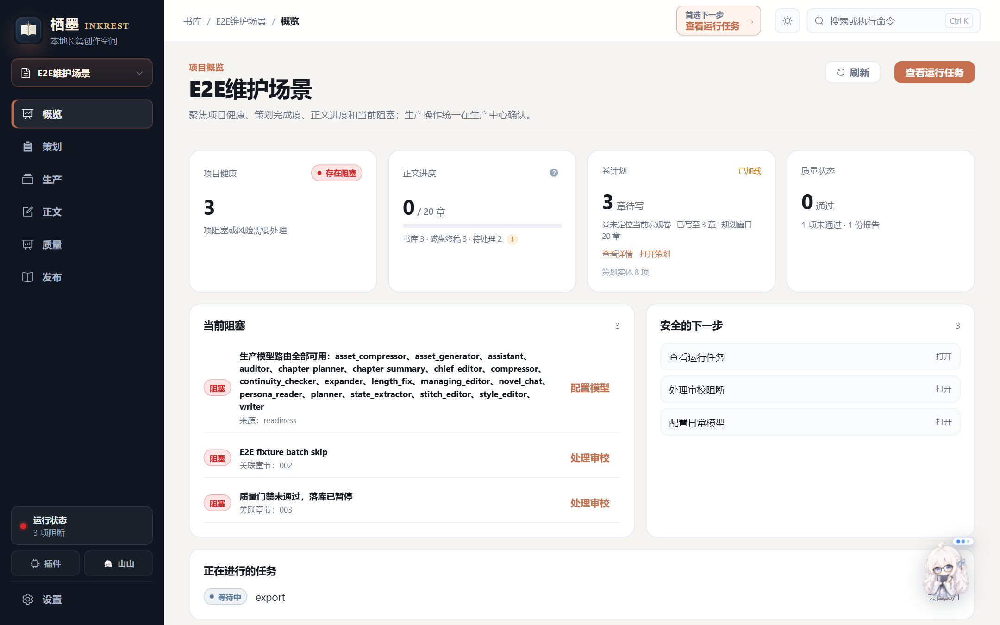
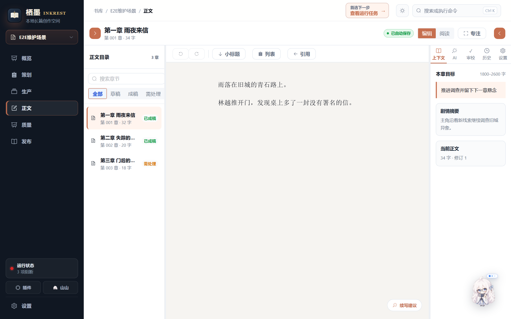
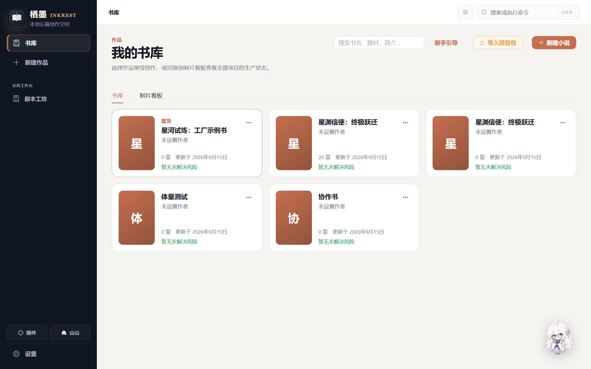

# 栖墨 · INKREST

**本地优先的多 Agent 长篇小说创作与生产工作台。**

栖墨不是一个“输入一句话、返回一段正文”的聊天壳。它把开书策划、章节生产、长篇记忆、去 AI 味、连续性检查、质量门禁、自动修章和多格式发布组织成一条可观察、可暂停、可人工介入的生产流水线。

> 从灵感到长篇：自动规划、辅助续写、审校修复，作者始终保留最终决定权。



## 为什么是栖墨

### 多 Agent 长篇生产流水线

一章正文不是一次模型调用，而是多个专职环节协作完成：

```text
全书策划 → 章节计划 → 场景并行写作 → 拼接与文风编辑
        → 连续性检查 → 统一质量门禁 → 自动修正
        → 正文入库 → 状态更新与向量索引
```

- 策划、写作、文风编辑、连续性检查、审校和状态维护各司其职。
- 支持全书规划、分批生产、断点续跑和连续失败熔断。
- 任务进度、费用、日志、阻塞原因和待修章节集中展示，不让流水线变成黑盒。
- 页面浏览和状态读取不会自动调用模型；生成、重写、审校与批量运行都需要用户显式发起。

### 去 AI 味不是一句 Prompt

栖墨把“降低模板感和机器腔”放进生成与审校闭环，而不是只在提示词末尾附加一句要求：

1. **写前约束**：向写作 Agent 注入文风、禁用表达和去 AI 味规则。
2. **全文文风编辑**：在不改变情节和人物动作的前提下，减少模板化过渡、空泛修饰和机械表达。
3. **本地规则检测**：检查情绪直述、抽象修饰、对话过度完整、套路式总结结尾等高频问题。
4. **统一质量门禁**：把 AI 味、连续性、敏感词、篇幅和审校结果汇总为可见报告。
5. **定向自动修正**：门禁阻断时可只改问题段落、自动修复章节或在人工改稿后重跑门禁。

去 AI 味能力用于降低机器感、提高文本自然度和编辑效率，不承诺规避或通过任何第三方 AI 检测平台。

### 为长篇连载保留记忆

- SQLite 统一保存正文、修订历史、任务和叙事状态。
- 上下文组装器按章节目标召回人物、设定、事件、伏笔、前章结尾和相关历史片段。
- 长篇体量可启用语义向量召回与索引，帮助跨章去重、伏笔回收和设定延续。
- 连续性检查与质量熔断会在问题扩散到后续章节前暂停生产，交给作者确认。

### 山山：驻场小编辑


山山不是单纯的桌面挂件。她常驻 Electron 桌面端，读取当前作品和生产状态，帮作者盯稿、排障和找到下一步：

- 展示当前作品、写作进度、运行任务、门禁阻断和全书暂停状态。
- 结合任务历史、门禁摘要与运行日志解释“为什么停了”。
- 提供模型连通性测试、单章重试、章节自动修复和门禁重跑等安全操作。
- 把作者带到正文、生产中心、设置或日志等正确页面。
- 在任务完成或失败时切换状态并提醒；对话模型可以单独配置。

山山不会擅自改大纲、删除项目、代写正文或绕过确认直接续跑全书。

## 核心能力

| 能力 | 说明 |
| --- | --- |
| 开书与策划 | 快速建书、模板建书或 AI 引导建书；管理大纲、卷纲、角色关系、世界设定、时间线与故事素材 |
| 正文工作区 | 章节目录、富文本编辑、自动保存、修订历史、上下文查看，以及按需续写、改写、润色、精简和扩写 |
| 全书生产 | 多阶段 Agent 流水线、场景并行、批量章节、断点续跑、失败重试和质量熔断 |
| 审校与修复 | AI 味、连续性、敏感词、篇幅与审校报告；支持自动修章、人工改稿和门禁重跑 |
| 长篇稳定 | 项目级 SQLite 真源、叙事状态、章节摘要、检查点和可选向量召回 |
| 山山助手 | 桌面驻场、任务提醒、状态解释、日志排障、页面指路和受控快捷操作 |
| 多模型路由 | 日常档、逻辑档、Agent 角色路由、模型库与失败回退链 |
| 发布与导出 | 从正文真源预览并导出 TXT、Markdown、DOCX、EPUB 3 和 PDF |
| 多项目与扩展 | 多本作品隔离、备份与重置、第一方插件清单、权限授权和项目级作用域 |
| 本地优先 | 作品、状态和任务保存在本地；模型密钥与用户作品不进入代码仓库 |

## 工作方式

栖墨既可以作为自动化生产线，也可以作为作者副驾：

- **新手自动模式**：质量门禁失败时暂停，并允许自动修正。
- **作者协作模式**：以人工写作为主，AI 建议和质量问题只在需要时介入。
- **平台审校模式**：使用更严格的质量门禁与审校策略。
- **长篇稳定模式**：加强跨章状态、连续性和向量就绪检查。
- **工作室模式**：面向多书与批量生产，提供连续失败熔断和集中处理入口。

无论使用哪种模式，浏览页面不会产生模型费用，可能消耗额度或改变正文的操作都由用户主动触发。

## 界面预览

### 正文工作区



### 书库



截图使用仓库内置示例书，不包含私人作品或模型密钥。

## 技术组成

| 层级 | 技术 |
| --- | --- |
| 后端 | Python 3.11 / 3.12、FastAPI、Pydantic、SQLite |
| 前端 | Vue 3、TypeScript、Pinia、Vite、Element Plus |
| 编辑与图形 | Tiptap、Vue Flow、TanStack Virtual |
| 桌面端 | Electron、electron-builder、PyInstaller |
| 导出 | TXT、Markdown、DOCX、EPUB 3、PDF |
| 测试 | pytest、Vitest、Playwright |

正文、任务和叙事状态以项目级 SQLite 为真源；工作区中的兼容文件与章节产物不会反向覆盖更新的数据。服务默认只监听 `127.0.0.1`，远程监听必须显式启用访问令牌。

## 快速开始

### 环境要求

- Python 3.11 或 3.12
- Node.js 22 或满足前端依赖要求的更新版本
- Windows 10 / 11（桌面打包与当前交付形态）

### 安装依赖

```powershell
py -3.12 -m pip install -r requirements.txt

cd web\frontend
npm ci
cd ..\..
```

### 准备本地配置

```powershell
Copy-Item config\pipeline.yaml.example config\pipeline.yaml
```

在 `config/pipeline.yaml` 或 `config/models.json` 中填写模型地址、模型名与密钥。这两个文件以及 `.env` 已被忽略，不应提交。

### 启动网页工作台

```powershell
py -3.12 main.py serve --no-browser
```

然后访问 `http://127.0.0.1:8000`。
如果 `python` 已指向 Python 3.11/3.12，也可使用 `python main.py serve --no-browser`。

### 构建桌面端

```powershell
cd web\frontend
npm run electron:pack
```

构建完成后运行：

```text
web\frontend\dist-desktop\win-unpacked\栖墨.exe
```

完整安装包构建使用 `npm run electron:build`。

## 命令行示例

下面的干跑模式使用静态模型，不消耗模型额度：

```powershell
py -3.12 main.py run-chapter `
  --chapter-id 001 `
  --goal "主角雨夜回到出租屋，并遭遇第一次异常。" `
  --dry-run
```

章节产物位于当前项目的 `workspace/chapters/`。不要在未经确认的情况下运行连续生成、批量章节或真实模型任务。

## 验证

后端：

```powershell
py -3.12 -m pytest tests/ --ignore=tests/smoke -q --tb=short
```

如果 `python` 已指向 Python 3.11/3.12，等价命令为
`python -m pytest tests/ --ignore=tests/smoke -q --tb=short`。

前端：

```powershell
cd web\frontend
npm run test:unit
npm run test:electron
npm run build
npm run check:bundle
```

更完整的提交、性能、端到端和桌面打包门禁见 [贡献与本地验证](CONTRIBUTING.md)。

## 数据与安全

- `.env`、`config/pipeline.yaml`、`config/models.json` 不进入版本控制。
- `projects/`、`workspace/`、`data/`、`state/`、`logs/`、`backups/` 与构建产物默认忽略。
- 项目备份与 V2 重置都要求输入带项目编号的精确确认词，并在重置前生成可校验备份。
- API 返回、日志与备份流程会对密钥进行隔离或脱敏。
- 插件启用前需要基于清单哈希授予权限。

详见 [V2 数据备份与重置](docs/V2-DATA-RESET.md) 和 [远程部署安全](docs/remote-deployment-security.md)。

## 项目文档

- [架构与代码结构](docs/ARCHITECTURE.md)
- [贡献与本地验证](CONTRIBUTING.md)
- [插件作者指南](docs/plugins/PLUGIN_AUTHOR.md)
- [Agent 集成](docs/AGENT-INTEGRATION.md)
- [V2 数据备份与重置](docs/V2-DATA-RESET.md)
- [远程部署安全](docs/remote-deployment-security.md)

## 当前授权状态

仓库目前没有附加开源许可证，保留所有权利。私有开发不受影响；如果将来公开并希望他人使用、修改或分发代码，应先选择并加入合适的开源许可证。
