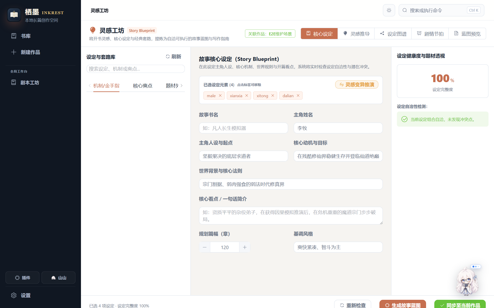
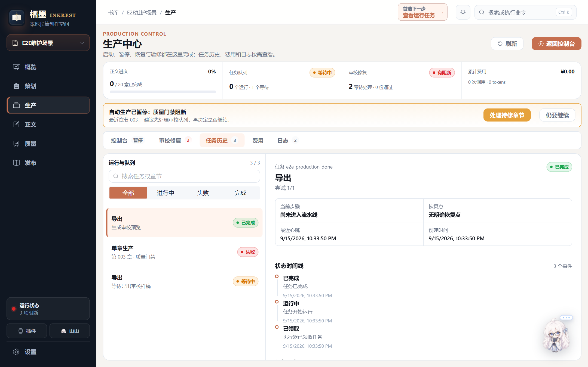
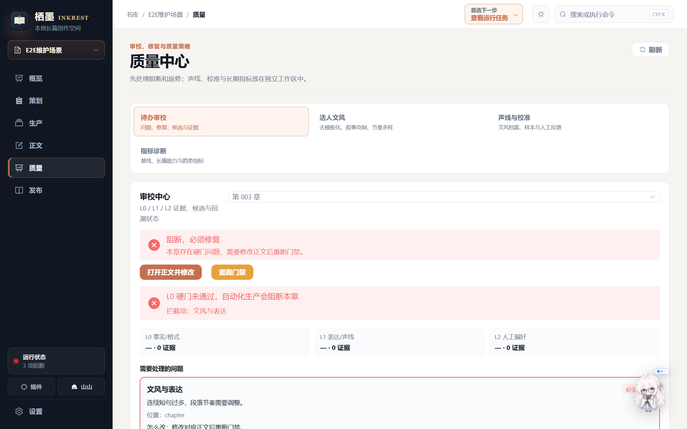
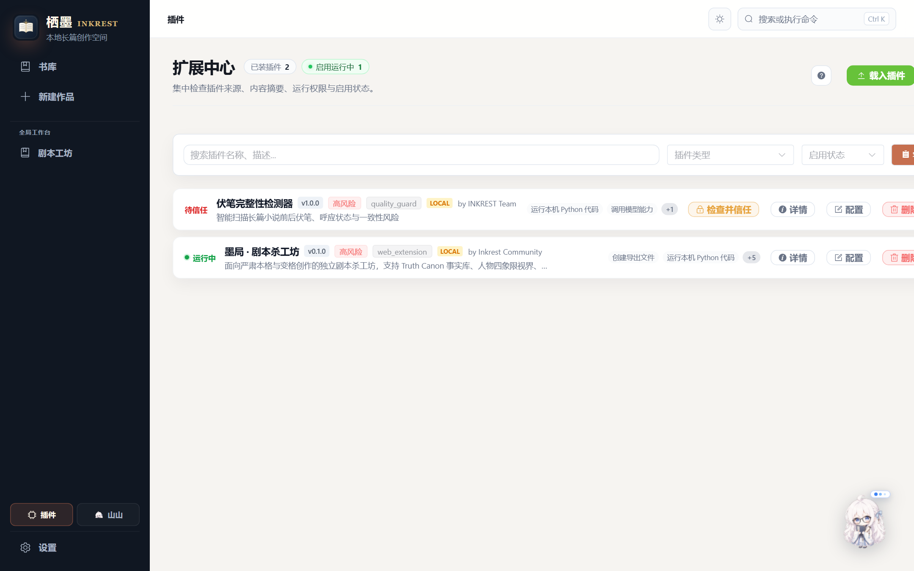
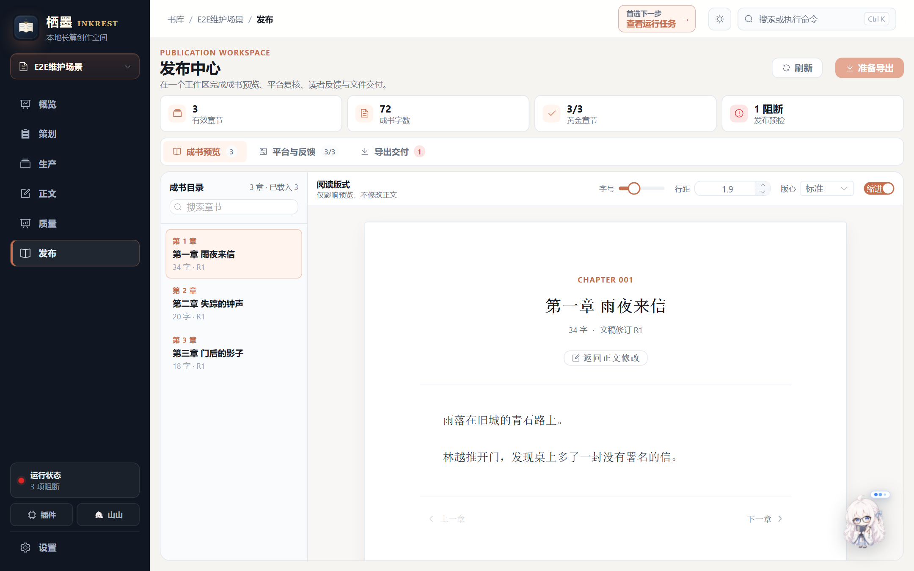

# 栖墨 · INKREST

<p align="center">
  <strong>面向专业作家的本地优先、多 Agent 长篇小说创作与工业化生产工作台</strong>
</p>

<p align="center">
  <a href="https://github.com/rowanjove/INKREST/releases/tag/v2.1.0"></a>
  <a href="LICENSE"></a>
  
  
  
  
</p>

<p align="center">
  <a href="README.md">简体中文</a> | <a href="README.en.md">English</a>
</p>

---

栖墨（INKREST）不是一个简单的“输入一句话、吐出一段正文”的套壳聊天对话框。它将**开书策划、灵感工坊（Story Blueprint）、正文深度编辑、人机协同写作引擎（HWE）、多 Agent 生产流水线、长篇状态与向量记忆、去 AI 味双重约束、全景质量门禁、插件平台 2.0 与全格式发布**组织成一条可观察、可暂停、可定向介入的现代工业化生产闭环。

> **核心原则**：AI 提供生产力与推演建议，作者始终掌握作品的终审权与最终决定权。

---

## 📸 界面画廊与工作流

### 1. 生产大盘与全局概览
全书进度、生产流水线、活动任务、门禁健康度与字数趋势一览无余。


### 2. 灵感工坊与故事蓝图 (Story Blueprint)
从初始构思、核心母题到三幕冲突编译推演，支持自动生成卷纲与场景卡。


### 3. 正文写作工作区 (Manuscript Workspace)
集成 Tiptap 富文本编辑器、虚拟目录树、实时字数统计、行内润色、段落扩写与受保护选区编辑。


### 4. 工业级多 Agent 生产中心 (Production Center)
支持全书连写流水线、场景级并行生成、断点续跑、连续失败自动熔断与实时 Agent 执行日志。


### 5. 全景质量中心与连续性门禁 (Quality Center)
内置多道质量门禁：连续性校验、违禁词审查、剧情矛盾拦截、去 AI 味检测与定向自动修章。


### 6. 插件平台 2.0 (Plugin Platform & SDK)
提供独立 IPC 进程沙箱、声明式权限授权机制，支持官方伏笔巡检、剧本杀推理等生态扩展。


### 7. 多平台发布与全格式导出 (Publishing Center)
正文真源校验、排版预览，支持一键导出 TXT、Markdown、DOCX、EPUB 3 与高保真排版 PDF。


### 8. 我的书库与多作品隔离 (Project Library)
本地多作品平滑切换，支持全局配置、数据一键安全备份与版本重置。


---

## ⚡ 为什么选择栖墨？

### 1. 多 Agent 分工的工业级长篇生产线
在栖墨中，一章小说不是一次黑盒单次调用，而是由多个专职 Agent 严密配合完成：
```text
┌──────────────┐     ┌──────────────┐     ┌────────────────┐
│  全书/卷纲策划  │ ──> │   章节细纲分解  │ ──> │  多场景并行写作   │
└──────────────┘     └──────────────┘     └────────────────┘
                                                  │
┌──────────────┐     ┌──────────────┐     ┌───────▼────────┐
│ SQLite 状态真源│ <── │ 统一质量终审门禁│ <── │ 场景拼接与文风精修│
└──────────────┘     └──────────────┘     └────────────────┘
```
- **多模型灵活路由**：规划/逻辑档（如 Claude 3.5 / DeepSeek-R1）、正文写作档（如 DeepSeek-V3 / GPT-4o）、审校档各尽所长。
- **长篇连载不断片**：SQLite 统一保存全局设定、人物小传、故事事实账本与剧情检查点。
- **混合记忆召回**：支持全文精确检索与基于语义的向量（ChromaDB / SQLite-VSS）召回，防遗忘、防吃设定。

### 2. 去 AI 味不是一句空洞的提示词
真正的“去机器腔”必须深入生成与质检的全链路：
- **写前约束**：注入专业作家文风模版、禁用表达集与句式节奏律。
- **全文文风修编**：剔除“不仅如此”、“仿佛在诉说着”、“眼中闪过一丝复杂”等高频 AI 腔。
- **HWE（人机协同引擎）**：受保护选区锁定，确保作者手写的黄金金句绝对不被 AI 篡改覆盖。
- **定向修章闭环**：当门禁阻断时，仅重写问题段落或由作者手工修订后重新放行。

### 3. 本地优先与数据私密性 (Local-First)
- 作品、正文、历史版本、设定集与运行日志**全部保存在本地**。
- 支持接入本机完全离线的 **Ollama / vLLM / LM Studio** 本地模型，零 API 费用、零作品外泄风险。
- 项目导出与备份具备哈希校验机制，安全可靠。

### 4. 桌面驻场小编辑：山山
- 常驻 Electron 桌面浮窗，能够感知作品进度与生产线状态。
- 在生产流水线触发熔断或异常时，第一时间用通俗语言解释原因，并提供单章重试、跳过或直接跳转对应工作区。

---

## 🚀 快速上手

### 方式一：下载 Windows 桌面端（推荐普通用户）
访问 [Releases 页面](https://github.com/rowanjove/INKREST/releases/tag/v2.1.0) 下载：
- **安装包**：`Setup.2.1.0.exe`（支持自动更新与快捷方式）
- **绿色便携版**：`2.1.0.exe`（解压即用，适合移动存储）

### 方式二：从源码启动（开发者与跨平台用户）

**环境要求**：
- Python **3.11 或 3.12**
- Node.js **>= 22.12.0**

```powershell
# 1. 克隆代码仓库
git clone https://github.com/rowanjove/INKREST.git
cd INKREST

# 2. 配置 Python 虚拟环境与依赖
py -3.12 -m venv .venv
./.venv/Scripts/python.exe -m pip install -r requirements.txt

# 3. 复制配置文件模板
Copy-Item config/pipeline.yaml.example config/pipeline.yaml

# 4. 构建前端静态资源
cd web/frontend
npm ci
npm run build
cd ../..

# 5. 启动本地服务
python main.py serve --no-browser
```
启动后在浏览器打开：`http://127.0.0.1:8000` 即可进入工作台。

### 本地桌面构建与打包

运行打包命令可将前端与后端打包为 Windows 桌面客户端：

```powershell
cd web/frontend
npm run build:backend
npm run electron:pack
```

构建完成后产物位于 `win-unpacked/栖墨.exe`。完整的安装包可通过 `npm run electron:build` 生成。

---

## 🛠️ 模型配置

首次进入系统，进入 **设置 -> 模型配置** 或编辑本地 `config/pipeline.yaml`：

```yaml
# 示例：支持接入任意 OpenAI 兼容接口或本地离线模型
llm:
  provider: "openai_compatible"
  base_url: "https://api.deepseek.com/v1"
  api_key: "sk-your-api-key"
  model: "deepseek-chat"

# 纯本地离线部署示例 (Ollama，无需 API Key)
# base_url: "http://127.0.0.1:11434/v1"
# model: "qwen2.5:14b"
```

> [!NOTE]
> `config/pipeline.yaml`、`config/models.json` 及 `.env` 均已加入 `.gitignore`，您的私有密钥和本地模型地址绝对不会被误提交。

---

## 🧪 自动化测试与质量检验

栖墨拥有完备的质量自动化守护体系（1450+ 项单元与集成测试）：

```powershell
# 运行后端全量测试套件
python -m pytest tests/ --ignore=tests/smoke -q --tb=short

# 运行前端单元测试
cd web/frontend
npm run test:unit

# 运行前端 Bundle 体积守卫
npm run check:bundle
```

---

## 📂 架构概览

```text
novel_agent/              # 核心业务内核
├── domain/blueprint/     # 灵感工坊与故事蓝图领域模型与编译器
├── human_writing/        # 人机协同写作引擎 (HWE) 与去 AI 味算法
├── plugins/              # 插件平台 2.0 运行隔离、生命周期与能力调度
├── state/                # SQLite 状态仓储、事实账本与长篇记忆
├── pipeline/             # 多 Agent 协同流、场景并发与生产任务调度
└── quality/              # 规则与模型双重审校门禁
web/                      # Web 后端与交互层 (FastAPI)
└── frontend/             # 现代化桌面/Web 前端 (Vue 3 + Vite + Element Plus + Pinia)
    └── electron/         # Electron 桌面主进程、IPC 安全沙箱与自动更新
packages/inkrest-plugin-sdk/ # 官方第一方插件 SDK
```

---

## 📄 开源许可

本项目基于 [Apache License 2.0](LICENSE) 协议开源。
有关第三方依赖与版权声明，请参阅 [NOTICE](NOTICE)。
