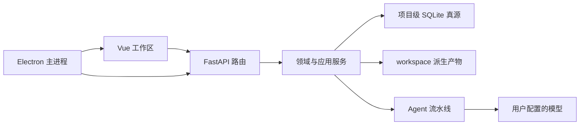

# 栖墨架构说明

本文描述栖墨 V2 的公开架构、代码边界和数据真源。实际行为以代码、Pydantic
模型和测试为准。

## 产品与技术边界

栖墨是本地优先的长篇小说生产工作台。FastAPI 后端负责项目隔离、多智能体
流水线、SQLite 状态和导出；Vue 3 前端提供策划、正文、生产、发布和设置工作区；
Electron 将两者打包为 Windows 桌面应用。

页面加载和状态读取不会自动调用模型。章节生成、批量运行、重写和审校必须由
用户显式发起。

| 层 | 技术 |
| --- | --- |
| 后端 | Python 3.11 / 3.12、FastAPI、Pydantic、SQLite |
| 前端 | Vue 3、TypeScript、Pinia、Vite、Element Plus |
| 编辑与图形 | Tiptap、Vue Flow、TanStack Virtual |
| 桌面 | Electron、electron-builder、PyInstaller sidecar |
| 导出 | TXT、Markdown、DOCX、EPUB、PDF |
| 测试 | pytest、Vitest、Playwright |



## 目录结构

```text
.
├── main.py / cli.py                  # 服务与 CLI 入口
├── novel_agent/
│   ├── agents/                       # 专职 Agent
│   ├── domain/                       # 任务、正文、发布等领域对象
│   ├── exporters/                    # 五格式导出器
│   ├── phases/                       # 生成与审校阶段
│   ├── plugins/                      # 插件系统与权限
│   ├── services/                     # 应用服务与聚合读模型
│   └── state/                        # SQLite 仓储、schema 与 YAML 投影
├── web/
│   ├── app.py                        # FastAPI 装配
│   ├── context.py                    # 项目、任务与插件作用域
│   ├── project_manager.py            # 项目注册与文件生命周期
│   ├── routes/                       # HTTP 端点
│   └── frontend/
│       ├── src/                      # Vue 应用
│       ├── electron/                 # Electron 主进程与 preload
│       ├── e2e/                      # Playwright 测试
│       └── scripts/                  # 打包后烟测
├── prompts/ / assets/ / presets/     # 内置模板和演示素材
├── scripts/                          # 构建、校验与性能工具
├── tests/                            # 后端与契约测试
└── docs/                             # 面向使用者和贡献者的文档
```

`projects/`、`workspace/`、`state/`、`data/`、`logs/`、`backups/`、
`build/`、`dist*` 和 Electron 打包目录是运行时数据或生成物，不属于源码。
仓库中的 `assets/demo_projects/` 是经过脱敏的演示项目。

## 后端分层

- `web/routes/` 负责 HTTP 校验与错误映射，不复制领域规则。
- `web/context.py` 管理当前项目、项目级任务管理器和插件管理器。
- `novel_agent/domain/` 保存不依赖 UI 的类型与规则。
- `novel_agent/services/` 负责跨仓储用例、工作区读模型、发布和安全重置。
- `novel_agent/state/` 负责 SQLite schema、仓储和兼容投影。
- `novel_agent/phases/` 与 `novel_agent/agents/` 负责生成流水线。
- `web/server.py` 仅保留兼容入口；新代码应直接依赖上下文、路由或服务。

主要 API：

| 能力 | API |
| --- | --- |
| 项目 | `/api/projects` |
| 项目快照 | `/api/projects/current/snapshot` |
| 策划聚合 | `/api/planning/workspace` |
| 正文 | `/api/manuscript/*` |
| 生产 | `/api/production/*` |
| 发布 | `/api/publishing/*` |
| 备份与重置 | `/api/projects/{id}/backup`、`/api/projects/{id}/reset-v2` |
| 插件 | `/api/plugins/*` |

## 前端与 Electron

`web/frontend/src/` 按 `app`、`views`、`components`、`entities`、`features`、
`composables`、`stores`、`shared/ui` 和 `api` 分层。页面容器只负责组合，
跨页面项目状态由 Pinia store 管理；任务更新以 WebSocket 为主、HTTP 为兜底。

`web/frontend/electron/` 是桌面主进程、preload、窗口和 IPC 的唯一源码。
本地旧副本 `electron_version/` 不参与构建。渲染进程启用
`contextIsolation`、禁用 Node integration，preload 只暴露最小 IPC 白名单。
桌面图标位于 `web/frontend/build/`，是受版本控制的打包输入。

## 数据真源

| 数据 | 权威来源 | 派生或兼容来源 |
| --- | --- | --- |
| 正文 | SQLite `documents`、`document_revisions` | `chapter_final.txt` |
| 任务 | SQLite `tasks`、`task_status_events` | 内存中的执行句柄 |
| 叙事状态 | SQLite narrative tables | `state/*.yaml` |
| 章节计划与报告 | `workspace/chapters/chapter_*/` | SQLite 章节紧凑索引 |
| 项目注册与当前项目 | `projects.json` | 无 |
| 项目配置与用户素材 | 项目内 `config/`、`prompts/`、`assets/` | 版本表或缓存 |
| 向量召回 | 配置的向量后端 | SQLite 摘要和章节产物 |

正文保存采用乐观修订检查，每次接受编辑都会先创建修订。发布和导出始终从
SQLite 正文按规范章节顺序读取。磁盘正文可在缺失时做一次旧数据导入，但不得
覆盖更新的 SQLite 文档。

YAML 镜像由 `runtime.yaml_mirror_mode` 控制：

- `write`：写入 SQLite 后同步兼容 YAML。
- `read_only`：SQLite 是唯一写入源，YAML 只读或按需导出。
- `off`：完全禁用兼容镜像。

按需导出使用 `POST /api/database/export-yaml-mirror`。

## 任务状态

任务状态为 `pending`、`claimed`、`running`、`paused`、`succeeded`、
`failed`、`cancelled`。状态转换必须通过任务仓储完成并写入事件表，不能直接
修改数据库状态字段。重启后的恢复依据 SQLite 中的状态、原因、租约、心跳和
检查点；内存对象不是真源。

每本书拥有独立的任务管理器。切换当前项目不会销毁其他项目正在运行的任务。
删除、重置或导入项目时会校验注册项目边界、活跃任务、路径穿越和项目外符号
链接。

## Factory 模式

Factory 行为以 `novel_agent/control/factory_policy.py` 为准，界面文案来自
`web/factory_modes.json`。只有项目元数据显式设置 `factory_mode` 时才启用：

| 模式 | 主要策略 |
| --- | --- |
| `newbie_auto` | 质量门禁失败时阻断，允许自动改写 |
| `author_copilot` | 只报告问题，不自动改写 |
| `platform_review` | 严格门禁与高质量审校 |
| `longform_stable` | 长篇稳定策略，并检查向量后端就绪状态 |
| `studio` | 工作室批量生产与连续失败熔断 |

## 配置与安全

- `.env`、`config/pipeline.yaml`、`config/models.json` 是本地配置，不提交。
- API 返回、日志和备份不得暴露完整密钥。
- 默认服务只监听 `127.0.0.1`；远程监听必须配置访问令牌。
- 插件在导入本地代码前需要按清单内容摘要授予信任与权限。
- 新业务逻辑优先进入服务层，路由保持薄。
- 不从派生文件反向覆盖 SQLite 新数据，不在页面加载时触发生成。

插件扩展见 [插件作者指南](plugins/PLUGIN_AUTHOR.md)，数据维护见
[V2 数据备份与重置](V2-DATA-RESET.md)，远程使用见
[远程部署安全](remote-deployment-security.md)。
