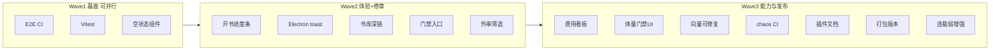

# 栖墨 · 升级计划 Batch2（一次搞完）

> 范围：除 PLAN 非目标三项外的全部后续升级（质量护栏、体验抛光、写书能力、扩展发布）。  
> 状态：**已落地**（2026-06-07）· 预估总工时 **6～9 人天**（单人连续推进）  
> 前置：Batch1（WS 全量 + 书库角标 + 估费 + 审查修复）已落地；Batch2 验证：`pytest` 591 绿、`npm run test:unit` 20 绿、`npm run build` 绿。

---

## 0. 非目标（本计划不做）

与 [PLAN-全书链路与人机协同.md](./PLAN-全书链路与人机协同.md) 第 7 节一致：

- 合并 Electron 单章与服务端批量为同一进程
- 删除 `run-batch` / `run-arc` 后端能力
- 连载运营 Tab 与主链路**深度耦合**（仅允许弱耦合增强，见 WS-E3）

---

## 1. 总览：五条主线 · 15 个工作包

| 主线 | 代号 | 包数 | 一句话 |
|------|------|------|--------|
| 质量护栏 | **QA** | 3 | CI 能挡回归，前端有关键单测 |
| 体验抛光 | **UX** | 4 | 空状态、进度、桌面断线、书库深链 |
| 连写更稳更省 | **A** | 3 | 真费用、体量门禁可感知、向量可修复 |
| 修章更顺 | **B** | 3 | 外审筛选、门禁入口、角标→维护 |
| 扩展发布 | **E** | 2 | 插件示例文档、打包版本自动化 |

---

## 2. 工作包明细

### QA · 质量护栏

#### QA-1 · Playwright E2E 进 CI

**目标**：PR/主分支自动跑一条浏览器冒烟（默认 mock 后端或 test fixture）。

| 项 | 内容 |
|----|------|
| 扩 spec | `web/frontend/e2e/batch-run.spec.ts`：书库加载、切换项目、连写弹窗打开（不真调 LLM） |
| 新增 spec | `e2e/maintenance-repair.spec.ts`：章节维护「修章队列」区块可见 |
| CI | `.github/workflows/novel-agent-full.yml` 增 job `e2e`：起 uvicorn + `E2E_RUN=1 playwright test` |
| 本地 | `CONTRIBUTING.md` 补「E2E 本地跑法」一行 |

**验收**：CI 绿；无后端时本地 `npm run test:e2e` 仍 skip。

**主要文件**：`.github/workflows/novel-agent-full.yml`、`web/frontend/e2e/*.spec.ts`、`web/frontend/playwright.config.ts`

---

#### QA-2 · Vitest 单元测试

**目标**：关键前端纯函数有真 Vitest，不只靠 Python 契约镜像。

| 覆盖 | 文件 |
|------|------|
| 章数合并/持久化 | `utils/batchRunForm.ts` |
| 估费 | `utils/tokenCostEstimate.ts` |
| 告警过滤 | `utils/pipelineAlertFilters.ts`（若已有） |

**脚手架**：`web/frontend/vitest.config.ts`、`package.json` 脚本 `test:unit`。

**验收**：`npm run test:unit` ≥ 15 cases 绿；契约测试保留作 UI 回归。

---

#### QA-3 · Chaos 长跑进 CI（可选触发）

**目标**：`scripts/chaos_long_run.py` 以 `workflow_dispatch` 每周/手动跑。

| 项 | 内容 |
|----|------|
| 新 workflow | `.github/workflows/novel-agent-chaos.yml` |
| 产物 | 上传 summary JSON / 日志 artifact |
| 门槛 | 失败不挡 PR，仅 main 手动 + schedule |

**验收**：手动触发一次成功；文档写明「非 PR 门禁」。

---

### UX · 体验抛光

#### UX-1 · 开书清单进度条

**目标**：`ProjectReadinessCard` 从「N 项待完成」升级为可视进度。

| 项 | 内容 |
|----|------|
| UI | 环形或条形进度：`ok/total`；全绿时保持现有文案 |
| 数据 | 复用 `buildReadinessItems` / `readinessAllOk` |
| 契约 | `tests/test_workspace_ui_contract.py` 断言 `readiness-progress` |

**主要文件**：`components/workbench/ProjectReadinessCard.vue`、`utils/projectReadiness.ts`

---

#### UX-2 · 三处空状态统一

**目标**：书库空、修章队列空、日志空 — 同一视觉与 CTA 模式。

| 场景 | 现状入口 | 统一后 CTA |
|------|----------|------------|
| 书库无项目 | `LibraryView` `.empty-library` | 新建 / 导入 |
| 无待处理章 | `PendingChaptersPanel` / `PipelineAlertsBanner` | 去工作台连写 / 看日志 |
| 日志空 | `LogStream` / `TaskLog` | 去开书 / 刷新 |

**实现**：新建 `components/EmptyStatePanel.vue`（icon + title + desc + 1～2 button），三处替换内联空 UI。

**验收**：契约测试检查组件引用；设计 token 用现有 `--color-text-muted` 等。

---

#### UX-3 · Electron 断线 toast

**目标**：桌面版后端不可达时，用户看到明确提示而非静默失败。

| 项 | 内容 |
|----|------|
| 检测 | `api.ts` 响应拦截或 `App.vue` 定时 `getSystemReadiness` / `/api/health` |
| UI | 顶部 `el-alert` 或 toast：「栖墨后台未响应，请重启应用或检查端口」 |
| 去重 | 同一断线周期只弹一次；恢复后自动关闭 |

**主要文件**：`web/frontend/src/api.ts`、`App.vue`；若 Electron 壳有独立 health，读 `electron/` preload。

**验收**：停后端后 10s 内出现提示；恢复后消失。

---

#### UX-4 · 书库角标 → 修章维护深链

**目标**：点「待处理 N 章」进入**该书**的章节维护并展开队列。

| 项 | 内容 |
|----|------|
| 交互 | `LibraryView` 角标 `@click` → `switchProject(id)` → `router.push('/chapters/maintenance?expand=alerts')` |
| 维护页 | `ChapterMaintenance` / `usePendingPanelExpand` 读 query 自动展开 |
| 防冒泡 | 与卡片「打开项目」点击区分清楚 |

**验收**：有角标的书点角标直达维护；无角标不显示。

---

### A · 车道 A：连写更稳更省

#### A-1 · 真实费用看板

**目标**：弹窗粗估之外，展示本书累计/本轮真实 LLM 成本。

| 后端 | 新增或扩展 `GET /api/novel/cost-summary`：读 SQLite `llm_cost_log` + 最近 `autopilot_rounds.jsonl` 的 `tokens_used` |
| 前端 | 日志中心或设置页折叠区「费用摘要」：今日/本书/最近连写轮 |
| 口径 | 与 `novel_agent/pricing.py` 一致；展示 disclaimer「估费/落库可能有延迟」 |

**主要文件**：`novel_agent/state/sqlite_store.py`（查询）、`web/routes/outlines.py` 或新 `cost.py`、`components/CostSummaryPanel.vue`

**验收**：跑 1 章 dry_run 后看板有数据；单测 mock store。

---

#### A-2 · 按体量调节门禁（可感知）

**目标**：`epic/infinite` 抽检策略在设置里可读、可选，不是藏在 YAML。

| 项 | 内容 |
|----|------|
| 设置 | `PipelineRuntimeConfig` 或新折叠：「长篇抽检模式」说明 + 链接 `runtime_policy` |
| 只读展示 | 当前 `audit_profile` / `pipeline_tier` 与体量 `scale_profile.scale` 对应关系 |
| 文档 | 设置页 2～3 行用户语言，非开发者术语 |

**验收**：切换体量后设置说明变化；不改变默认行为除非用户显式改配置。

---

#### A-3 · 长篇向量「可修复」

**目标**：黄条从「提示」升级为「检测 → 指引 → 一键跳转设置」。

| 项 | 内容 |
|----|------|
| API | 复用 `/api/embedding/status`；缺配置时返回 `fix_steps[]` |
| UI | `ProjectReadinessCard` / 连写弹窗：按钮「去向量设置」`router.push('/config#embedding')` |
| 可选 | 「用 stub 继续」二次确认文案（长篇风险） |

**验收**：stub 状态下 readiness 有明确 fix CTA；有效 embedding 时黄条消失。

---

### B · 车道 B：修章更顺

#### B-1 · 修章队列筛选与分组增强

**目标**：章节维护里按「门禁阻断 / 批量跳过 / 待外审」Tab 或筛选，与 `pipelineAlertFilters` 对齐。

| 项 | 内容 |
|----|------|
| UI | `PendingChaptersPanel` 顶部分段控件；计数与侧栏 badge 一致 |
| 数据 | 复用 `GET /api/pipeline-alerts` |

**验收**：三类告警能筛选；契约测试更新。

---

#### B-2 · 「只重跑门禁」入口补全

**目标**：章节列表行级快捷操作（不必进详情）。

| 项 | 内容 |
|----|------|
| UI | `ChapterList.vue` 对 `quality_blocked` 章显示「只重跑门禁」 |
| API | 复用现有 gate rerun endpoint（与 `ChapterDetail` 一致） |

**验收**：列表一点提交；失败有 `failure_hint`。

---

#### B-3 · 外审续跑策略可配置

**目标**：有待外审章时，续跑行为可预期。

| 项 | 内容 |
|----|------|
| 设置 | `runtime.block_continue_until_external_pass` 开关 + 说明（后端已有则只补 UI） |
| 续跑 | 连写弹窗：若有待外审，显示黄条「N 章待外审，通过后再续跑」或 `force` 路径说明 |
| 列表 | 维护页「仅外审」筛选（与 B-1 合并实现） |

**验收**：开关开时 `continue` 被拦且有明确文案；关时可续跑。

---

### E · 扩展与发布

#### E-1 · 插件示例与开发者指引

**目标**：`hello_guard`、`txt_export_hook` 可被新手发现、复制。

| 项 | 内容 |
|----|------|
| 文档 | `plugins/examples/README.md`：复制到 `plugins/`、启用、类型对照 |
| UI | `PluginManager` 空状态或帮助区：「查看示例插件」链到 README |
| 注 | 启用/禁用 UI **已存在**，不重复造 |

**验收**：按 README 可在空项目启用 hello_guard。

---

#### E-2 · 打包与版本自动化

**目标**：发 portable/Electron 前版本号、清单、CHANGELOG 一致。

| 项 | 内容 |
|----|------|
| 脚本 | 对齐 `scripts/verify_bundle_manifest.py`；`VERSION` bump 规则 |
| 文档 | `CONTRIBUTING.md` 发布清单 5 步 |
| 可选 | package.json / electron version 与根 `VERSION` 同步脚本 |

**验收**：`verify_bundle_manifest.py` 通过；发布清单可照着走一遍。

---

#### E-3 · 连载运营弱耦合增强

**目标**：不并入主链路，只让「连载 Tab」与权威进度一致、导出好用。

| 项 | 内容 |
|----|------|
| 进度 | 连载 Tab 字数/章数读 `progress_summary` 或 batch-status，与监控一致 |
| 导出 | 保留「连载全文 txt / 已更新 zip」；空状态用 UX-2 组件 |
| 禁止 | 不把连载状态写入 `continue` 门槛 |

**验收**：工作台与连载 Tab 章数一致；连写门槛不受连载 Tab 影响。

---

## 3. 执行顺序（一次搞完推荐）

按依赖排序；同序号可并行。

| 步 | 包 | 工时 | 依赖 |
|----|-----|------|------|
| 1 | QA-2 Vitest | 0.5d | — |
| 1 | UX-2 空状态组件 | 0.5d | — |
| 2 | UX-1 进度条 | 0.5d | — |
| 2 | UX-4 书库深链 | 0.5d | — |
| 2 | B-1 修章筛选 | 0.5d | — |
| 3 | B-2 列表门禁 | 0.5d | B-1 |
| 3 | B-3 外审策略 UI | 0.5d | B-1 |
| 3 | UX-3 Electron toast | 0.5d | — |
| 4 | A-3 向量可修复 | 0.5d | — |
| 4 | A-2 体量门禁 UI | 0.5d | — |
| 5 | A-1 费用看板 | 1d | pricing 已有 |
| 6 | QA-1 E2E CI | 1d | UX-1,4 |
| 6 | E-1 插件 README | 0.25d | — |
| 6 | E-2 打包版本 | 0.5d | — |
| 7 | E-3 连载弱增强 | 0.5d | UX-2, A-1 可选 |
| 8 | QA-3 chaos workflow | 0.25d | — |

**合计**：约 **6.5～8 人天**。

---

## 4. 整体验收（Batch2 Done 定义）

### 工程

- [x] `pytest tests/ --ignore=tests/smoke` 全绿
- [x] `npm run build` 绿
- [x] `npm run test:unit` 绿
- [x] CI `novel-agent-full` 含 E2E job（待 push 后首次绿）

### 产品 · 车道 A

- [x] 费用看板能显示本书累计成本与最近连写轮 tokens
- [x] 长篇向量 stub 有「去设置修复」路径
- [x] 体量与门禁说明在设置可见

### 产品 · 车道 B

- [x] 书库角标一点进该书修章维护
- [x] 维护页可筛「外审 / 门禁 / 跳过」
- [x] 章节列表可「只重跑门禁」

### 体验

- [x] 三处空状态视觉统一
- [x] 开书清单有进度条
- [x] Electron 断线有 toast

### 扩展

- [x] `plugins/examples/README.md` 可跟着启用示例
- [x] 发布清单 + manifest 校验文档就绪
- [x] 连载 Tab 进度与主链路一致（不耦合续跑门槛）

---

## 5. 关键文件索引

| 领域 | 路径 |
|------|------|
| E2E | `web/frontend/e2e/`、`playwright.config.ts` |
| Vitest | `web/frontend/src/utils/*.ts` |
| 空状态 | `web/frontend/src/components/EmptyStatePanel.vue` |
| 书库 | `web/frontend/src/views/LibraryView.vue` |
| 修章 | `PendingChaptersPanel.vue`、`ChapterList.vue`、`ChapterMaintenance.vue` |
| 费用 | `novel_agent/pricing.py`、`sqlite_store` `llm_cost_log` |
| 向量 | `EmbeddingConfig.vue`、`projectReadiness.ts` |
| 插件 | `plugins/examples/`、`PluginManager.vue` |
| 连载 | `Dashboard.vue` serialization tab、`progress_summary` |
| CI | `.github/workflows/novel-agent-full.yml` |

---

## 6. 风险与缓解

| 风险 | 缓解 |
|------|------|
| E2E 在 CI  flaky | 固定 fixture 项目；retry 1；失败 artifact 截图 |
| 费用 API 与估费不一致 | UI 分栏「落库实耗」vs「弹窗预估」 |
| 外审拦续跑误伤 | 默认关或仅 warn；设置明示 |
| 一次改太多回归 | 每包独立 commit；QA-2 + 契约测试兜底 |

---

*维护：每完成一包，在 IMPROVEMENT-ROADMAP 增勾选，并在 PLAN 第 8 节追加一行。*