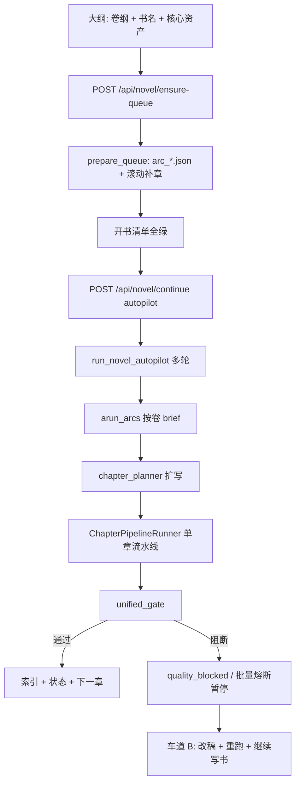

# 栖墨 · 全书链路与人机协同改进计划

> 整理自 2026-06 产品/工程讨论：全书跑通性、入口收敛、半自动修章（含外站 AI 审核）。
> 状态：主路径 A～D + P2/P3 backlog 已落地（外审状态、只重跑门禁、试发导出、进度统一、跳过暂停阈值）。

---

## 1. 背景与目标

### 1.1 现状结论

- **标准路径可跑通**：大纲保存 → `ensure-queue` → `continue`（autopilot）→ `arun_arcs` → 单章流水线（generation → audit → post_audit → unified_gate）→ 落盘/索引。
- **逻辑分层合理**：规划队列（卷/滚动补章）与执行流水线、长跑策略（熔断/续跑）分离清晰。
- **主要问题**：入口重复、前后端门槛不一致、失败章处理偏「跳过」、半自动修章能力分散未形成动线。

### 1.2 总目标

| 目标 | 说明 |
|------|------|
| **稳** | 全书启动/续跑可预期，少「能点但跑挂」 |
| **简** | 连写入口收敛为 1 启动 + 1 续跑（同一弹窗/参数） |
| **人机并存** | 保留并强化半自动：内部门禁 + 外站改稿后再跑 |
| **可运维** | 监控/山山能看懂阻断章与底层日志 |

### 1.3 产品模型：双车道

```text
车道 A · 连写（默认宣传）
  大纲 → 开书清单全绿 → 工作台「自动生成章节」→ 运行监控看进度/续跑

车道 B · 半自动修章（必须保留、写进引导）
  生成/门禁阻断 → 写作页或章节详情改稿 → 重跑审校/门禁 → 本章通过 → 再继续写书
  外站 AI 审核：栖墨门禁 ≠ 平台上架；需复制正文 → 平台试发 → 回软件改正文再跑
```

**原则**：收敛只动 **车道 A**；**车道 B** 入口不删，改为「修章 / 补跑」并接到监控待办。

---

## 2. 全书主路径（对齐实现）



**与 CLI `arun_novel()` 关系**：UI 不走「从零总编+拆卷」冷启动，而用已有 `outline.json` + 队列；`POST /api/novel/run` 保留为调试/高级。

---

## 3. 优先级 backlog

### P0 — 稳跑（后端 + 关键 UX）

| # | 项 | 说明 | 主要改动 |
|---|-----|------|----------|
| P0-1 | **continue 服务端 readiness** | 与前端 `projectReadiness` 一致，防绕过 UI | `web/routes/outlines.py` 或统一 `novel_run_service`；复用 `buildReadinessItems` / `readinessAllOk` |
| P0-2 | **续跑前队列健康** | `arc_queue_stale`、无 `arc_*.json` 时 400 + 指引「同步卷队列」 | `ensure-queue` 与 `continue` 前置校验；对齐 `outline_sync` |
| P0-3 | **批量异常策略** | 运行异常不应静默跳章留空洞 | `orchestrator._run_chapter_briefs`：连续 `emit_error` 计入熔断或写入「待重试」列表；文档化行为 |
| P0-4 | **统一全书续跑入口** | 监控横幅勿裸调 `continue(max_chapters:0)` | `useNovelBatchRun()` composable；`BatchRunStatusBanner` 复用工作台弹窗 |
| P0-5 | **熔断后续跑确认** | `circuit_breaker` 暂停时默认先处理章节 | `resume` 增 `force_resume`；熔断态 UI：主 CTA「待处理章」次 CTA「仍继续写书」 |

### P1 — 体验与可运维

| # | 项 | 说明 | 主要改动 |
|---|-----|------|----------|
| P1-1 | **入口收敛（车道 A）** | 全书仅：开书清单启动 + 监控继续写书 | 页头已去重复「自动生成」；监控改文案与弹窗复用 |
| P1-2 | **半自动枢纽（车道 B）** | 监控页「待处理章节」 | 接 `pipelineAlerts` / `quality_blocked`；操作：去写作页、章节详情、复制全文 |
| P1-3 | **修章入口命名** | 不单删「运行单章」 | 工作台对话框 →「高级 · 补跑单章/列表」；章节列表 → 链写作页或标「修章」 |
| P1-4 | **进度口径说明** | SQLite 章数 vs checkpoint vs arc_progress | 运行监控任务卡/帮助一行说明 |
| P1-5 | **山山/日志上下文** | autopilot 轮次、阻断章摘要 | 扩展 `assistant` context（部分已有 `agent_runtime_logs`） |
| P1-6 | **两道审核文案** | 内部门禁 vs 外站审核 | 章节详情 / 门禁区固定提示 + `postCreateChecklistLines` |

### P2 — 质量、成本、回归

| # | 项 | 说明 | 主要改动 |
|---|-----|------|----------|
| P2-1 | **按体量调节门禁** | epic/infinite 抽检 vs 章章全审 | `runtime_policy` / `generation_policy` 文档 + 设置页模式说明 |
| P2-2 | **向量 stub 长篇提示** | embedding warn 不阻断时的风险 | 开书清单/体量条强化说明 |
| P2-3 | **冒烟 E2E** | 无真 LLM 的回归链 | fixture 项目：`ensure-queue` + autopilot 1 轮（mock/dry_run） |
| P2-4 | **调试 API 分级** | `novel/run`、`novel/run-arc` | `api.ts` deprecated；设置开发者折叠区（可选） |

### P3 — 可选增强（外站半自动）

| # | 项 | 说明 |
|---|-----|------|
| P3-1 | 章节状态「待外审 / 外审已通过」（人工勾选，续跑策略可配置） |
| P3-2 | 「只重跑门禁」按钮（不必从 planner 重来） |
| P3-3 | 批量导出/复制便于平台试发 |

---

## 4. 入口收敛细则（车道 A）

### 4.1 收敛后用户可见入口

| 场景 | 唯一主推 | 次级 |
|------|----------|------|
| 启动全书 | 工作台 · 开书清单「自动生成章节」 | — |
| 暂停/完成后续写 | 运行监控「继续写书」（同弹窗） | — |
| 修某一章 | **写作页 AI 写作** | 工作台「补跑单章」、章节详情 |
| 自定义多章无规划 | 工作台「高级 · 列表批量」 | 标注不走卷队列 |

### 4.2 API 分级

| 级别 | 接口 | UI |
|------|------|-----|
| 公开 | `ensure-queue`、`continue`（加强校验）、`chapters/run` | 主路径 |
| 高级 | `chapters/run-batch` | 高级对话框 |
| 内部 | `novel/run`、`novel/run-arc` | 不对普通用户展示 |

### 4.3 实施阶段

| 阶段 | 内容 | 预估 |
|------|------|------|
| **Phase A** | 监控横幅复用工作台弹窗 + composable；熔断 CTA | 1～2 天 |
| **Phase B** | P0-1～P0-3 后端校验与异常策略 | 2～3 天 |
| **Phase C** | P1-2～P1-3 半自动枢纽 + 修章文案 | 2 天 |
| **Phase D** | P2 冒烟 + 调试 API 隐藏（可选） | 1～2 天 |

---

## 5. 半自动修章细则（车道 B）

### 5.1 标准环

```text
自动生成 → 内门阻断 / 外站拒稿
  → 监控「待处理」或章节列表
  → 写作页改正文（或复制到平台改完再贴回）
  → 章节详情：从审校重跑 / 运行监控重试说明
  → unified_gate 通过
  → 「继续写书」（resume 跳过已完成章）
```

### 5.2 保留能力（禁止在收敛中删除）

- 写作页 `runChapter` / Electron 子进程单章
- 章节详情：复制全文、`unified_gate` 报告、`quality_blocked` 续跑提示
- 工作台：单章 + 列表 `run-batch`（高级）
- 设置：门禁模式、自动修正、`quality_auto_rewrite`

### 5.3 设置建议（文案层）

| 用户类型 | 建议 |
|----------|------|
| 追求连写 | 阻断 + 自动修正开 |
| 外站严审 / 半自动 | 阻断开，自动修正可关；熔断后先修章再续跑 |

---

## 6. 验收标准

### 6.1 车道 A

- [x] 新用户文档只需：**大纲 → 工作台自动生成 → 监控**
- [x] 全书相关按钮 ≤ 2 个（启动 + 继续），**同一弹窗、同一参数**
- [x] 直连 API `continue` 在未就绪时返回明确缺项
- [x] `arc_queue_stale` 时无法盲目续跑

### 6.2 车道 B

- [x] 监控可见阻断章列表，一键进写作页/章节详情
- [x] 章节详情明示：栖墨通过 ≠ 平台通过
- [x] 熔断后不能无确认「无上限续跑」
- [x] 补跑单章/列表在 UI 上标为「修章/高级」，与自动生成区分

### 6.3 工程

- [x] P2 冒烟测试（`test_api_novel_readiness` + `test_novel_run_guard`）
- [ ] `test_novel_autopilot` / `test_orchestrator` 保持绿（随全量 pytest 维护）

---

## 7. 非目标（本计划不做）

- 合并 Electron 单章与服务端批量为同一进程
- 删除 `run-batch` / `run-arc` 后端能力
- 替代外站审核（仅支持导出改稿后再跑）
- 连载运营 Tab 与主链路深度耦合（另立需求）

---

## 8. 已完成（持续更新）

| 日期 | 项 | 说明 |
|------|-----|------|
| 2026-06 | WS 全量改进 | 连写弹窗记住章数/本轮进度、书库待处理角标、按日常模型估费、`autopilot_rounds` 含 tokens、示例插件 hello_guard + txt_export_hook、Playwright/E2E 脚手架、修章队列命名与山山三步排障 |
| 2026-06 | 远期收尾 | progress_sync 写入统一、连载运营对齐权威进度、暗色告警 token、RESTORE 文档 |
| 2026-06 | P2/P3 全量 | 外审状态、只重跑门禁、试发批量复制、progress_summary、跳过暂停、debug run 门禁、连写文案 |
| 2026-06 | 体验加固 | 待重试一键修章、batch-status 待处理数、山山上下文、按 loop 的 TaskManager 锁、GitHub smoke CI |
| 2026-06 | 加固 | 坏 `outline.json` 阻断续跑；`batch_retry_queue` + 监控待处理合并；continue 全书任务互斥 |
| 2026-06 | Phase D | `NovelProgressHelp`、设置「开发者·全书 API」、`test_api_novel_readiness`、api 废弃标注、体量门禁说明 |
| 2026-06 | Phase C | `repairWorkflow` 文案、`SemiAutoRepairHint`、待处理章节增强、章节列表/详情修稿入口、设置推荐组合 |
| 2026-06 | Phase A/B | `novel_run_guard`、`/api/novel/readiness`、`force_resume`、共享 `useNovelBatchRun` + `NovelBatchRunDialog`、监控「继续写书」、熔断确认与「先去改稿」 |
| 2026-06 | 此前 | Agent 实时日志、山山上下文、页头去重、书库/设置/山山 UI 等（见原表） |

### 8.1 历史已完成

| 项 | 说明 |
|----|------|
| Agent 实时日志 | 框内滚动、跟随/锁定、runtime 缓冲 + `/api/runtime-logs` |
| 山山上下文 | `agent_runtime_logs`、`system_log_tail`、合并 `recent_logs` |
| 工作台页头 | 已移除重复「自动生成章节」，仅开书清单保留 |
| 运行监控布局 | Tab 内滚动、底部留白，减轻截断感 |
| 书库卡片 | 章节/字数/更新三列信息卡 |
| 山山对话 | 快捷问题 2 条、清空 🗑️ |
| 设置默认折叠 | 向量嵌入、流水线等 `expanded=false` |

---

## 9. 建议执行顺序（总览）

```text
1. Phase A（P0-4、P0-5）     续跑入口 + 熔断 UX
2. Phase B（P0-1～P0-3）    后端门槛 + 异常策略
3. Phase C（P1-1～P1-6）    半自动枢纽 + 文案 + 修章入口命名
4. Phase D（P2-1～P2-4）    设置说明 + 冒烟 + API 分级
5. P3 按反馈排期           外审状态、只重跑门禁等
```

---

## 10. 关键文件索引

| 领域 | 路径 |
|------|------|
| 编排 | `novel_agent/orchestrator.py` |
| Autopilot | `novel_agent/services/novel_autopilot.py` |
| 单章流水线 | `novel_agent/services/chapter_pipeline.py` |
| 门禁 | `novel_agent/services/unified_gate.py` |
| 任务 | `web/tasks.py` |
| API | `web/routes/outlines.py` |
| 开书清单 | `web/frontend/src/utils/projectReadiness.ts` |
| 工作台 | `web/frontend/src/views/Dashboard.vue` |
| 监控续跑横幅 | `web/frontend/src/components/BatchRunStatusBanner.vue` |
| 章节修稿 | `web/frontend/src/views/ChapterDetail.vue`、`WritingWorkspace.vue` |

---

*维护：完成功能项后更新第 8 节，并将对应 `#` 在 backlog 中勾选。*