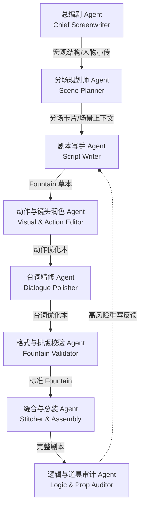
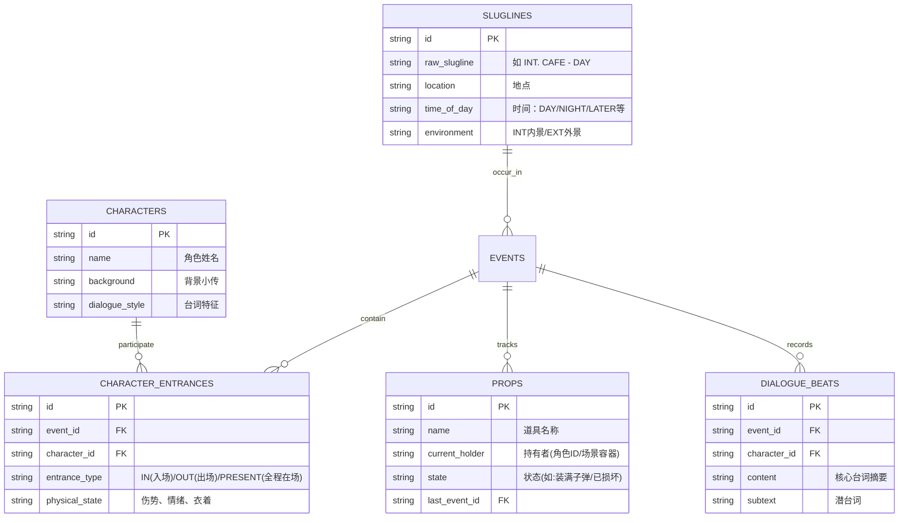

# ScriptAgent：全自动剧本生成系统设计方案

本项目致力于基于现有的多 Agent 协同小说生成系统（`NovelAgent`），升级、重构并定制出一套面向影视、短剧、动漫创作的**全自动工业级剧本生成系统（ScriptAgent）**。

剧本具有极强的镜头感、动作化叙事和严苛的工业排版规范。本方案旨在保留原有系统的“多模型路由”、“多步流水线”、“状态同步”与“审计-重写闭填”的基础上，针对剧本特有的结构和表达进行深度适配。

---

## 一、 剧本与小说的核心技术差异与应对策略

剧本（Screenplay）与小说（Novel）在媒介本质和创作规范上存在巨大差异，必须在 Agent 流水线的设计上进行底层定制：

| 差异维度 | 小说（Novel） | 剧本（Screenplay） | ScriptAgent 应对策略 |
| :--- | :--- | :--- | :--- |
| **呈现格式** | 大段的叙事段落、对话混排，排版较自由。 | 严苛的工业格式（Slugline 场景头、动作描写、角色名、台词、括号备注）。 | 全面引入并支持 **Fountain 格式标准**。核心写手与校验 Agent 均以 Fountain 语法为统一通信格式。 |
| **叙事逻辑** | 包含大量内心独白、背景介绍及“上帝视角”的抽象总结。 | **“Show, Don't Tell”**。凡是摄影机拍不到、录音机录不到的内容，一律不得出现在剧本中。 | 设计 **“动作视觉化润色 Agent”**，自动过滤主观心理描写，将其转换为具体的神态、肢体动作与道具交互。 |
| **结构单元** | “卷”-“章”-“场景”。章节长度弹性大，情节侧重叙事流。 | **三幕式/八序列结构**。以“幕（Act）”和“场（Scene）”为核心，每场戏都有明确的时间地点边界。 | 支持“电影模式（三幕式/八序列）”和“短剧模式（高频爆点分集）”的双模大纲生成器。 |
| **台词与对白** | 对话可包含文学修饰，允许冗长解释。 | 极致口语化，具有强烈的**潜台词（Subtext）**和角色方言/独特性，拒绝AI腔。 | 引入 **“台词精修 Agent”**，专门进行“台词瘦身”与“潜台词注入”，使对白充满冲突与生命力。 |
| **状态追踪** | 侧重心理变化、好感度、世界观设定等宏观状态。 | 侧重**人物出入场、空间转移、道具归属、关键线索**等物理一致性。 | 升级 SQLite 状态表，增加角色出入场表（Entrance）、关键道具流转表（Props）和场景头目录表（Sluglines）。 |

---

## 二、 八大剧本 Agent 角色矩阵

原有的 10 个小说 Agent 被重构和精简为 **8 个剧本专属 Agent**。每个角色均有独立的职责边界和提示词模版：



### 1. 总编剧 Agent (Chief Screenwriter)
*   **职责**：负责宏观创意。根据用户输入的 Logline、题材与要求，生成符合“三幕式”（电影模式）或“分集大纲”（短剧模式）的宏观大纲，并输出详细的人物小传（核心动机、性格弱点、台词特质）与核心冲突。
*   **输入**：剧本概念、Logline、题材、集数/时长、特殊要求。
*   **输出**：主旨说明、人物设定库、宏观结构大纲（JSON 格式）。

### 2. 分场规划师 Agent (Scene Planner)
*   **职责**：将宏观大纲细化为具体的**分场卡片（Scene Cards）**。每一张卡片对应剧本中的“一场戏”。
*   **输入**：宏观大纲、人物小传、上一场的状态总结。
*   **输出**：包含以下字段的 JSON 场景卡：
    *   `scene_id`：场景唯一编号。
    *   `slugline`：标准场景头（如：`INT. DORMITORY - NIGHT`）。
    *   `characters_present`：出场人物列表。
    *   `purpose`：本场戏的叙事目的（推进了什么、改变了什么关系）。
    *   `entry_state` & `exit_state`：人物进入和离开时的情绪/物理状态。
    *   `conflict_focus`：冲突焦点。
    *   `props_involved`：涉及的关键道具。
    *   `beats`：场内节奏点（3-5个主要画面或台词交锋点）。

### 3. 剧本写手 Agent (Script Writer)
*   **职责**：根据场景卡与上下文包（Context Pack），撰写符合 Fountain 语法标准的剧本初稿。
*   **输入**：场景卡、上下文中召回的先前事件、写作指南（Fountain 语法规范说明）。
*   **输出**：未润色的 Fountain 格式剧本片段。

### 4. 动作与镜头润色 Agent (Visual & Action Editor)
*   **职责**：执行 **"Show, Don't Tell"** 原则。删除所有无法通过画面直接呈现的心理描写（如“他内心非常挣扎，后悔自己当年的选择”），将其改写为具体的外部视觉与动作（如“他死死攥着那张泛黄的合影，直到指关节发白，然后将它揉成一团扔进废纸篓”）。
*   **输入**：Fountain 剧本片段。
*   **输出**：动作与视觉描写极大丰富、心理描写被完全过滤的 Fountain 文本。

### 5. 台词精修 Agent (Dialogue Polisher)
*   **职责**：优化对白。缩减冗长台词，增加台词的“潜台词（Subtext）”，使角色说话不直白、有交锋。确保角色的语言风格符合其人物小传中的“台词特质”（如粗俗、文雅、好用短句、有口癖等）。
*   **输入**：视觉润色后的 Fountain 文本。
*   **输出**：台词精炼、富有个性、口语化的 Fountain 文本。

### 6. 格式与排版校验 Agent (Fountain Validator)
*   **职责**：检测并修正 Fountain 语法排版。确保角色名大写、括号备注（Parenthetical）位置正确、场景头（Sluglines）拼写规范（必须以 `INT.` 或 `EXT.` 开头）、转场（Transitions）格式正确。
*   **输入**：排版混乱或不规范的 Fountain 文本。
*   **输出**：完全符合工业级 Fountain 标准的干净文本。

### 7. 缝合与总装 Agent (Stitcher & Assembly)
*   **职责**：将多场并行生成的剧本片段进行拼接，修复场景之间的转场（Transitions）连贯性，并检查时间跨度（例如，上一场是 `INT. CAFE - DAY`，下一场是 `EXT. STREET - NIGHT`，是否需要加 `LATER` 或转场过渡）。
*   **输入**：多场校验后的 Fountain 片段。
*   **输出**：连贯的剧本合集。

### 8. 逻辑与道具审计 Agent (Logic & Prop Auditor)
*   **职责**：检查剧本中是否存在逻辑漏洞。重点审计：
    *   **角色在场冲突**：未在 `characters_present` 中却突然说话，或者已离开房间却在后文有动作。
    *   **道具归属冲突**：如枪被 A 夺走，后文却写“B 扣动了扳机”。
    *   **时空冲突**：如上一秒在白天，下一秒在同一个地方变成了深夜，却没有时间过渡说明。
*   **输入**：总装后的完整剧本、当前 SQLite 物理状态。
*   **输出**：审计报告（risk_level: 低/中/高，具体逻辑漏洞列表，以及用于更新数据库的状态包 `state_update`）。
*   **重写机制**：若 `risk_level` 为“高”，将审计出的问题以 Feedback 形式打回“剧本写手 Agent”进行定向重写。

---

## 三、 15 步剧本生成流水线工作流 (The Pipeline)

剧本的生成由 `ScriptOrchestrator` 驱动，分为 15 个具体步骤，实现全自动的闭环生成：

```
┌─────────────────────────────────────────────────────────────────────┐
│  Step 1: 概念设计 (Chief Screenwriter)                              │
│  用户输入 → 生成宏观三幕式/分集结构与人物设定库                        │
├─────────────────────────────────────────────────────────────────────┤
│  Step 2: 宏观排期 (Managing Screenwriter)                           │
│  将大纲转换为场景列表（Scene List），确定每场的时空和叙事作用           │
├─────────────────────────────────────────────────────────────────────┤
│  Step 3: 分场卡片生成 (Scene Planner)                              │
│  为当前生成的“场（Scene）”设计分场卡片（Slugline、出场人物、节奏beats） │
├─────────────────────────────────────────────────────────────────────┤
│  Step 4: 场景上下文组装 (Context Compiler)                         │
│  从数据库检索先前场景发生的事件、涉及的道具状态、当前人物情绪           │
├─────────────────────────────────────────────────────────────────────┤
│  Step 5: 并行草稿撰写 (Script Writer × N)                           │
│  多场剧本并行生成，输出初始 Fountain 格式草本                         │
├─────────────────────────────────────────────────────────────────────┤
│  Step 6: 动作镜头视觉化 (Visual & Action Editor)                    │
│  过滤心理活动，将人物内心转化为具体的画面和肢体语言                   │
├─────────────────────────────────────────────────────────────────────┤
│  Step 7: 台词口语化精润 (Dialogue Polisher)                         │
│  台词瘦身，注入潜台词，增加角色台词辨识度                             │
├─────────────────────────────────────────────────────────────────────┤
│  Step 8: 场景合并与缝合 (Stitcher & Assembly)                       │
│  合并多场，修复转场（Transition）节奏与时间流逝承接                   │
├─────────────────────────────────────────────────────────────────────┤
│  Step 9: 格式规范性校验 (Fountain Validator)                        │
│  自动排版修正，确保 Fountain 语法完美无瑕                            │
├─────────────────────────────────────────────────────────────────────┤
│  Step 10: 连贯性与道具审计 (Logic & Prop Auditor)                    │
│  逻辑漏洞扫描：时空、在场角色、道具持有状态                           │
│  ── 若 risk_level == "高"，自动触发定向重写循环 ──                  │
├─────────────────────────────────────────────────────────────────────┤
│  Step 11: 敏感词硬匹配扫描                                           │
│  扫描违规敏感词并生成报告                                           │
├─────────────────────────────────────────────────────────────────────┤
│  Step 12: 人工审批门 (Approval Gate)                                 │
│  创作者可在 Web 界面对单场 Fountain 剧本进行精修、通过或驳回重写      │
├─────────────────────────────────────────────────────────────────────┤
│  Step 13: 状态继承与物理同步 (State DB Sync)                         │
│  将本场结束后的道具持有状态、角色情绪、事件更新写入 SQLite 数据库      │
├─────────────────────────────────────────────────────────────────────┤
│  Step 14: 场景向量索引 (Vector Store Index)                         │
│  对本场剧本进行语义分块与 Embeding 索引，便于后续场景进行前情检索     │
├─────────────────────────────────────────────────────────────────────┤
│  Step 15: 生成 PDF 与看板渲染                                         │
│  调用 Fountain 渲染引擎，生成标准剧本 PDF 以及 Web 看板               │
└─────────────────────────────────────────────────────────────────────┘
```

---

## 四、 剧本专属状态管理与资产库设计

剧本需要比小说更加严密的“物理一致性”追踪。我们将 SQLite 数据库架构重新设计，增加/重构为以下 10 张核心数据表：



### 1. 新增与优化的数据表结构

1.  **`sluglines` (场景目录表)**：
    *   `id` (TEXT, PK): 场景ID
    *   `raw_slugline` (TEXT): 原始场景头，如 `INT. POLICE STATION - NIGHT`
    *   `environment` (TEXT): `INT` (内景) 或 `EXT` (外景)
    *   `location` (TEXT): 场景物理位置（如：警察局）
    *   `time_of_day` (TEXT): 时间标识（如：`DAY`, `NIGHT`, `LATER`, `SAME`）

2.  **`props` (道具流转追踪表)**：
    *   `id` (TEXT, PK): 道具ID/名称（如 `gun_01`）
    *   `name` (TEXT): 道具显示名
    *   `current_holder` (TEXT): 当前持有该道具的角色名或所在场景位置（如 `JERRY`）
    *   `state` (TEXT): 道具的状态（如“已上膛”、“血迹斑斑”、“信封已拆开”）
    *   `last_event_id` (TEXT, FK): 最后一次改变道具状态的事件ID

3.  **`character_entrances` (角色出入场表)**：
    *   `id` (TEXT, PK): 主键
    *   `event_id` (TEXT, FK): 关联的事件ID
    *   `character_id` (TEXT, FK): 关联的角色ID
    *   `entrance_type` (TEXT): 出入场动作类型（`ENTER` 入场, `EXIT` 离场, `PRESENT` 持续在场）
    *   `physical_state` (TEXT): 此时的生理/心理状态（例如：“右臂流血”、“极度狂躁”）

4.  **`dialogue_beats` (台词与潜台词追踪表)**：
    *   `id` (TEXT, PK): 主键
    *   `event_id` (TEXT, FK): 关联事件ID
    *   `character_id` (TEXT, FK): 说话角色ID
    *   `content` (TEXT): 核心台词内容
    *   `subtext` (TEXT): 潜台词/潜在线索（用于后续连贯性校验）

5.  **`events` (事件流表)**：
    记录每场戏发生的核心情节块，用于 Context Builder 的历史召回。

---

## 五、 Web UI 与编辑器交互设计

前端界面将基于 Vue 3 + Element Plus 进行完全重构，呈现出极具科技感和工业感的**“数字化剧本创作工作台”**：

### 1. 剧本双栏编辑器（Fountain Editor）
*   **左侧：Fountain 语法编辑器**。支持 Fountain 语法的实时高亮（场景头、角色名、对话、括号备注等使用不同颜色标记）。支持自动补全（输入 `@` 触发角色名联想，输入 `.` 触发场景头联想）。
*   **右侧：标准剧本 PDF 预览**。采用 `WASP` 或 `Fountain.js` 渲染引擎，实时将左侧的 Fountain 纯文本排版为符合**好莱坞标准（12号 Courier New 字体、特定页边距、对白居中对齐）**的剧本格式。

### 2. 故事板与分场卡片管理器（Storyboard / Scene Cards）
*   提供**可视化看板**。每一个场景卡片都是一个可以拖拽的卡片（Card）。
*   用户可以在看板上随意调整场景的顺序。当调整顺序后，系统会自动更新场景的 `scene_id` 和依赖关系，并在下一次生成中自动依据新的顺序组装 Context Pack。
*   卡片上直观显示：本场场景头、在场人物头像、关键道具徽章、当前生成状态（未生成/生成中/待审批/已完成）。

### 3. “拍摄通告单（Call Sheet）”生成监控
*   将原有的“后台任务日志”设计为模仿剧组**“每日拍摄通告单 (Call Sheet)”**的 UI 风格。
*   显示当前正在生成的“通告戏份”（Active Scene），实时输出 LLM 的 Token 消耗、耗时、调用模型及当前正处于 15 步流水线中的哪一步。

### 4. 物理状态与道具追踪面板
*   **道具流向图**：以桑基图（Sankey Diagram）或时序线图展示某件重要道具（如“一封神秘信件”、“手枪”）在不同场景中、在不同角色之间的流转过程。
*   **角色出入场流线图**：清晰展示每个场景里角色的出场和离场时间，创作者可以一眼看出谁在什么时候缺席，避免“逻辑穿帮”。

---

## 六、 下一步实施计划与技术验证

为了保障此方案能够顺利落地，建议在第一阶段执行以下验证步骤：
1.  **Fountain 解析与渲染验证**：在前端引入 `fountain.js`，验证能够将任意 Fountain 文本实时渲染为完美的 Hollywood 剧本布局。
2.  **“Show, Don't Tell” Prompt 调优**：编写针对 `VisualAgent` 的提示词，使用真实长文本测试其过滤心理描写、输出视觉动作的效果。
3.  **道具状态机的 SQLite 触发器设计**：设计在写入 `state_update` 时自动级联更新 `props` 持有者及状态的数据库逻辑。
