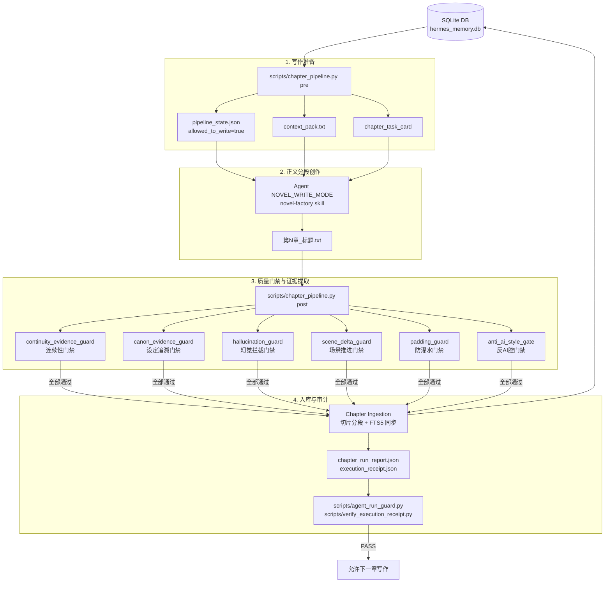

# Novel Pipeline - Write Engine 深度逆向分析报告

本报告是对 **Novel Pipeline - Write Engine** (AI 长篇小说工程化写作流水线) 的完整逆向工程与架构分析。该系统旨在通过 SQLite 长期记忆底座和 8 步硬性门禁流水线，解决 AI 在长篇创作中常见的**上下文断裂**、**设定忘却/幻觉**、**字数缩水**以及**AI腔/水文**等系统性缺陷。

---

## 一、 项目总览与核心哲学

Hermes Novel Engine 的核心设计思想可以用 16 个字概括：
> **SQLite 记住 → 门禁防偷懒 → 摘要防迷路 → 版本可回滚**

系统的核心哲学在于**把写作纪律代码化**。它不仅是提示词层面的限制，而是通过物理层面的文件锁、数据表一致性验证和命令执行收据审计，强制 AI Agent 必须在符合预定质量门禁（Evidence Gates）的前提下进行章节递进。

### 核心运作流程图


---

## 二、 源码目录与文件全景

项目代码布局高度聚焦，避开了复杂的 Web UI 和微服务架构，基于脚本和测试驱动：

| 目录/文件 | 大小 (Bytes) | 核心职责 |
|:---|:---|:---|
| `database/schema.sql` | 10,300 | SQLite 数据库结构（26张物理表 + 6张 FTS5 全文检索虚拟表） |
| `scripts/chapter_pipeline.py` | 56,681 | 核心总控脚本。实现 `pre`、`post`、`review`、`volume` 子命令，串联所有门禁与数据入库。 |
| `scripts/agent_run_guard.py` | 7,171 | 质量门禁自检审计。检查章节运行报告是否完全合格。 |
| `scripts/verify_execution_receipt.py` | 2,874 | 工具调用真实性审计。防止 Agent 捏造或跳过关键命令行步骤。 |
| `scripts/continuity_evidence_guard.py` | 10,179 | 提取上章结尾 Hooks 与本章开头做比对，验证上下文承接度。 |
| `scripts/canon_evidence_guard.py` | 10,913 | 提取正文硬事实声明，并强制其与任务卡、大纲或已知事实绑定。 |
| `scripts/hallucination_guard.py` | 12,355 | 拦截逻辑矛盾、人物境界突变、关系脱缰等幻觉，配合 `canon_evidence_guard`。 |
| `scripts/padding_guard.py` | 7,285 | 检测设定堆砌、空泛心理、对话复述和尾部总结等水文指标，输出 `padding_score`。 |
| `scripts/scene_delta_guard.py` | 6,256 | 分析各场景的推进量（情节、角色状态、世界观等），确保非空转。 |
| `scripts/init_db.py` | 3,107 | 数据库一键初始化脚本。 |
| `scripts/check_schema.py` | 4,152 | 校验数据库表结构及关键字段是否存在。 |
| `scripts/import_outline_skeleton.py` | 10,311 | 将 JSON 小说骨架数据导入并格式化写入到 `volume_plans` 和 `chapter_plans`。 |
| `scripts/backup_db.py` | 2,211 | 数据库及配置文件的极简在线物理备份。 |
| `docs/skills/` | - | Hermes Agent 的行为限制 Skill 文件，控制模型路由和规则底线。 |
| `tests/` | - | 覆盖 13 个独立测试文件的 pytest 套件（共 72 个 Case，全部通过）。 |

---

## 三、 数据架构：SQLite 长期记忆库

系统基于单一 SQLite 文件 `hermes_memory.db` 构建。设计上分为四个层次，并挂载 FTS5 全文索引。

### 1. 物理表层次结构

#### A. 通用记忆层（全项目通用）
- **`projects`**: 项目元数据，包括名称、描述、状态及时间戳。
- **`settings`**: 系统配置键值对。
- **`memories`**: 核心长期记忆表，包含 `type`（偏好/任务/代码/规则/系统等）、`tags`、`importance` 及正文。
- **`memory_logs`**: 针对长期记忆的操作审计日志。

#### B. 小说业务层
- **`novels`**: 小说全局表，记录 Slug 唯一标识、书名、类型、题材、目标字数及当前总字数。
- **`volumes`**: 卷级管理。
- **`chapters`**: 章节表，记录章节序号、标题、摘要、正文内容、字数及对应 TXT 文件路径。
- **`chapter_chunks`**: 章节切片表，将章节正文切为 800~1500 字的物理片段，在维持句子完整性的前提下提升局部检索精度。
- **`characters`**: 人物设定表，含别名、阵营角色（男主/配角/反派）、性格、能力、动机、关系网络和角色弧线。
- **`worldbuilding`**: 世界观设定，按修真/物理法则/地理/历史等 Category 归类。
- **`plot_threads`**: 伏笔追踪表，登记引入章、预期/实际回收章、类型、重要程度及当前状态（open/active/resolved/abandoned）。
- **`writing_rules`**: 写作规则控制，分为 style、forbidden、continuity 等，带有 `status='active'` 状态开关。
- **`chapter_summaries`**: 章节摘要信息，提供短摘要（100-200字）、长摘要（500-800字）、出场人物、新设定和伏笔变化。
- **`continuity_checks`**: 连续性检查历史日志。
- **`novel_logs`**: 小说项目层级的操作日志。

#### C. 版本与承诺层
- **`chapter_versions`**: 每次 `ingest` 时，无论之前该章是否已入库，都会触发自增版本快照（v1/v2/vN），并记录变更原因（`change_reason`）。**只增不删**，废弃版本仅标记为 `deprecated`。
- **`reader_promises`**: 读者爽点/情感承诺追踪表，标记建立章节、预期兑现范围（`expected_payoff_range`）及读者情绪（危机/打脸/爽点等）。

#### D. 规划与骨架层
- **`volume_plans`**: 卷级骨架表，存储每卷计划标题、卷核心目标（`volume_goal`）、卷首状态、卷末期望及待解钩子。
- **`chapter_plans`**: 章节级大纲，包括章节目标、核心冲突点、必须包含的要素、必须推进的伏笔/承诺，以及结尾悬念方向。
- **`title_history`**: 改名跟踪，自动捕获正文实际标题与骨架计划标题的偏差，记录修改原因。

### 2. FTS5 全文检索配置
在 `database/schema.sql` 中，建立了 6 个基于 `fts5` 的虚拟表，并绑定触发器以实现物理表更新时的实时无感同步：
- `memory_fts`（`memories` 的 title, content, tags）
- `novel_chapter_fts`（`chapters` 的 title, content, summary）
- `novel_chunk_fts`（`chapter_chunks` 的 content, summary, tags）
- `novel_character_fts`（`characters` 的 name, alias, identity, personality, tags）
- `novel_world_fts`（`worldbuilding` 的 title, content, tags）
- `novel_plot_fts`（`plot_threads` 的 title, content）

> [!NOTE]
> 在 `chapter_pipeline.py` 中，如果 SQLite 版本或环境不支持 FTS5 检索，代码内设计了自动降级降噪（Fallback）逻辑，回退到标准的 SQL `LIKE` 模糊匹配。

---

## 四、 8步写作流水线运作机理

`chapter_pipeline.py` 是引擎的心脏，将长篇小说写作解构成高内聚的执行状态机：

```
[命令行触发]
   │
   ├─► pre (准备阶段)
   │     ├─ 检查卷序完整性（警告前序卷为空）
   │     ├─ 读取上章 actual brief 及结尾 800-1200 字
   │     ├─ 提取近期 3 章摘要、人物、设定、未解决伏笔
   │     ├─ 导出 context_pack.txt 及任务卡参数
   │     └─ 生成 pipeline_state.json 锁文件 (allowed_to_write = true)
   │
   ├─► 写作与分段合成 (由 Agent 在 novel-factory skill 内部运行)
   │     └─ 产生正文 TXT 文件（第N章_标题.txt）
   │
   └─► post (收尾与门禁阶段)
         ├─ 验证 pipeline_state.json，确认 pre 已通过
         ├─ Step 4: word_count_gate （字数门禁）
         ├─ Step 5: continuity_gate （模糊词频连续性检查）
         ├─ Step 5.1: continuity_evidence_guard （章章连续证据门禁）
         ├─ Step 5.5: hallucination_gate （幻觉拦截）
         ├─ Step 5.6: canon_evidence_guard （设定来源追溯）
         ├─ Step 5.7: scene_delta_guard （场景推进度检测）
         ├─ Step 6: scene_quality_gate （估算场景数与动作密度）
         ├─ Step 7: anti_ai_style_gate （反AI文体过滤）
         ├─ Step 7.5: padding_guard （综合水文特征过滤）
         ├─ Step 8: ingest （持久化入库与切片）
         └─ 自动生成 chapter_brief.json / chapter_run_report.json
```

---

## 五、 5大证据门禁与核心算法剖析

系统依靠 5 个专职 Guard 脚本在 post 阶段进行静态与语义审查。

### 1. 连续性证据门禁 (`continuity_evidence_guard.py`)
用于提供物理证据，证明本章**实打实地**承接了上章结尾。
- **Hooks 提取算法**：通过正则匹配上章结尾（默认最后 400 字）中的未完成动作、省略号/疑问句不确定结尾、感知动词、伤势变化、地点位移：
  - 未完成动作：`(正要|准备|打算|决定|即将|就要|刚想|刚准备).{0,15}(?:[。！？\n]|$)`
  - 感知动词：`(发现|察觉|注意|看出|感觉到|意识到|感觉到).{0,20}(?:了|到|出)`
  - 伤势特征：`(受伤|流血|伤口|疼痛|晕|昏迷|中毒|发热|发冷|虚弱|透支)`
- **承接度验证**：提取 Hooks 中的 2-4 字中文关键词，验证本章开头 600 字是否包含这些关键词。
- **状态继承检查**：在上章结尾提取 `injuries`（伤势）、`items`（物品）、`tasks`（任务）和 `emotions`（情绪）标记，如果本章开头（前500字）未提及则计入 `forgotten_states`（遗忘状态）。
- **判定标准**：
  $$\text{continuity\_evidence\_score} = \text{hook\_score} \times 0.5 + \text{state\_score} \times 0.3 + \text{conflict\_score} \times 0.2$$
  其中，地点前后若发生突变（提取院/洞/室/殿/山/林等后缀词比对，无交集）则 $\text{conflict\_score} = 0.5$ 否则为 $1.0$。通过门禁的底线是：`missing_hooks = 0`，`forgotten_states = 0`，且得分 $\ge 0.8$。

### 2. 防水文门禁 (`padding_guard.py` & `scene_delta_guard.py`)
- **同义语句重复度检测**：
  用自然语言分句，对相邻的句子 $\text{sentence}_i$、$\text{sentence}_{i+1}$、$\text{sentence}_{i+2}$ 提取中文 2-4 字词集合。如果相邻句子的分词交集个数大于 3 词，判定为“连续三段同义”的凑字行为：
  $$\text{len}(S_i \cap S_{i+1}) > 3 \quad \text{and} \quad \text{len}(S_{i+1} \cap S_{i+2}) > 3 \implies \text{Repeated explanation detected}$$
- **空泛心理检测**：
  检索包含 `他(知道|明白|意识到|觉得|感觉|想起|想到)` 等心理词的句子，并检查其前后相邻句是否包含物理性动作动词（如 `蹲|站|走|跑|拿|放|劈|搬`）。若前后均无动作，计为空转心理独白。
- **对话回音检测**：
  匹配连续的引号对话组 `"[^"]{15,80}"`，比较双方说话的中文 2-4 字词重合度。如果重合度 $> 5$，视作对话双方复读确认相同废话。
- **场景增量度 (`scene_delta_guard.py`)**：
  - 基于时间/地点词前缀正则进行场景智能物理分割。
  - 为每个 Scene 审查 7 大增量维度（情节进展 `plot`、角色状态变化 `character_state`、关系发展 `relationship`、冲突升级 `conflict`、世界观扩展 `worldbuilding`、爽点承诺 `reader_promise`、结尾钩子 `next_hook`）。
  - 单个场景至少激活上述 2 个维度才算有效。整章必须满足：有效场景增量和 $\ge 3$（短章为 $\ge 1$），且低增量场景数不超过 1 个。

### 3. 防幻觉与设定追溯门禁 (`canon_evidence_guard.py` & `hallucination_guard.py`)
- **硬声明提取 (Hard Claims)**：
  通过庞大的正则表达式，在正文中抓取关于身份（`character_identity`）、境界突变（`character_realm`）、背叛结盟（`relationship`）、未知势力诞生（`faction`）、掌握新秘术（`cultivation_method`）、修改天道（`world_rule`）、时间线跳跃（`timeline`）和捡到法宝（`major_item`）的句子。例如，境界变化检测：
  `r'(突破|晋升|踏入|进阶).{0,10}(境界|层次|级别|阶段)'`
- **来源绑定 (Evidence Binding)**：
  对提取出的 Hard Claim，自动去匹配 `task_card.allowed_new_canon`、`task_card.must_include`、上章结尾 400 字、上一章 brief 文本以及已知世界观设定。若均未匹配上，标记为 `unsupported_hallucination`（无依据幻觉）。
- **硬性判据**：
  $$\text{evidence\_coverage} = 1.0 - \frac{\text{unsupported\_claims}}{\text{total\_hard\_claims}}$$
  门禁合格的底线要求：$\text{evidence\_coverage} \ge 0.95$ 且 $\text{unsupported\_claims} = 0$，且不得包含逻辑矛盾（`contradictions`）及提前兑现伏笔/读者承诺（`premature_payoff`）。

### 4. 卷承接门禁 (`volume_post`)
- 每卷结束时强制触发 `chapter_pipeline.py volume`，在数据库中总结并更新 `volume_plans`。
- 输出 `volume_01_report.json` 与 `volume_01_bridge_report.json`。
- 桥接报告中会固化本卷结尾状态（`ending_state`）、未解决钩子（`unresolved_hooks_to_next`）以及下卷的承接标准（`next_volume_opening_requirements`）。下一卷的第一章 `pre` 阶段会自动校验该桥接报告。

### 5. 执行证明收据门禁 (`verify_execution_receipt.py`)
- 预防 Agent “偷懒”或自然语言伪造执行。
- Agent 执行完一系列操作后，必须在磁盘写入 `execution_receipt.json`。
- 该收据记录了所有运行的 `commands_run`（必须包含 `pre`、`post`、`agent_run_guard`、`pytest`、`git status`、`git diff`）、每个命令的 `exit_code`、运行时间戳、新产生的文件及下步行动（`next_action`）。
- 验证器要求关键命令退出码必须为 0，git 状态已记录，且 `guard_result == "PASS_NOVEL_WRITE_GUARD"`，否则强行中断后续流水线。

---

## 六、 Agent 路由与自检审计协议

Hermes Agent 不仅要依赖这套系统，本身也是该协议的强制执行者。

### 1. `novel_factory_router_SKILL.md` 的路由逻辑
- **NOVEL_WRITE_MODE 拦截**：当用户输入包含 "写第 N 章"、"续写"、"写正文" 等触发词时，Agent 的 Prompt 路由强制其进入 `NOVEL_WRITE_MODE` 并绑定 `novel-factory` skill，拒绝在普通聊天模式下直接吐出小说正文。
- **正文执行头**：正文模式下，Agent 必须首先输出固定执行头：
  ```
  mode = NOVEL_WRITE_MODE
  required_skill = novel-factory
  skill_called = true
  pipeline = pre → task_card → scene_plan → write_chunks → assemble_chapter → word_count → continuity → hallucination → scene → anti_ai → padding → ingest
  ```
- **报错拦截机制**：如果 Skill 不可用或环境不支持，必须输出 `ERROR: novel-factory skill not available.` 并挂起。

### 2. 迭代预算保护（`agent_iteration_budget.md`）
为了防止在修改大型代码/生成长文本时工具调用超限（Token 或 Round 上限，通常为 90 次），项目制定了严格的**预算保护机制**：
- **预算区间与行为模式**：
  - $> 50$ 次剩余：**正常开发**。
  - $30 \sim 50$ 次：**收缩模式**。不开启新的章节或大范围架构修改。
  - $15 \sim 30$ 次：**收尾模式**。只做测试修复和报告导出。
  - $< 15$ 次：**冻结模式**。停止写入，输出进度总结和 `NEXT_PROMPT` 以便接续。
  - $< 8$ 次：**只读模式**。严禁任何修改或测试，仅输出交接方案。
- **强制交接输出**：每次执行结束必须打印当前变更文件、已完成/待完成项、测试运行结果、接续 `next_prompt` 以及剩余预算。

---

## 七、 门禁标准一览表

| 门禁 (Gate) | 数据/逻辑来源 | FAIL 判定标准 | 恢复/处理机制 |
|:---|:---|:---|:---|
| **Pipeline 锁** | `pipeline_state.json` | 缺少该文件，或 `allowed_to_write != true` | 拒绝 `post` 执行，须先运行 `pre` 命令。 |
| **字数门禁** | `chapter_pipeline.py` | 字符数低于类型下限（普通/重点/高潮 $< 1900$，短章 $< 300$） | 拦截入库。建议补充新剧情场景，严禁凑字。 |
| **连续性证据** | `continuity_evidence_guard.py` | 未包含上章 hooks 关键词，或者遗漏伤势/物品/任务状态 | 拦截入库。必须重写章节开头，承接上文 hooks。 |
| **防幻觉门禁** | `hallucination_guard.py` | 出现逻辑矛盾、境界突变、角色关系脱缰 | 拦截入库。修正正文中冲突的词句设定。 |
| **设定追溯** | `canon_evidence_guard.py` | 硬事实覆盖率 $\text{coverage} < 95\%$ 或存在无来源的幻觉设定 | 拦截入库。将新设定记录在 `task_card.allowed_new_canon`。 |
| **场景推进** | `scene_delta_guard.py` | 有效场景数 $< 3$（短章 $< 1$）或低增量场景数超过上限 | 拦截入库。需丰富场景情节互动，合并多余的空场景。 |
| **反AI腔** | `chapter_pipeline.py` | 10 项 AI 腔高频特征词句（如“不是A而是B”、“那一刻他终于明白”）累计 $> 2$ 处 | 拦截入库。修改工整排比句、总结腔，用动作代替心理。 |
| **反水文** | `padding_guard.py` | 出现连续同义句、设定堆砌无动作、复读对话，水文评分 $\text{score} > 60$ 或级别为 `fail` | 拦截入库。精炼废话，替换掉纯独白和冗余复述。 |
| **执行证明** | `verify_execution_receipt.py` | `execution_receipt.json` 缺少、不完整，或者有 exit_code $\ne 0$ 的关键命令 | 强行终止写作。检查并重新运行出错的脚本或测试。 |

---

## 八、 逆向结论与总结

本项目是 AI 辅助小说写作领域里**极具工程素养和控制力**的架构范本。它没有堆砌流行的“向量数据库 + Agent 框架 (LangChain/AutoGen)”等重型组件，而是将所有重心放在**物理质量门禁的建立与验证**上：
1. **轻量可靠**：采用 SQLite 3 单文件做记忆体，利用 FTS5 原生检索和 Python 静态正则做语义审计，具备高响应与低开销特点。
2. **闭环约束**：利用 pipeline 文件锁、版本快照快照、运行收据（Receipt）和自检审计（Guard），全方位堵死了 Agent 在遇到困难时“自然语言作弊”的退路。
3. **架构参考**：该项目的防灌水分级算法、硬事实追溯逻辑以及分段写作的 chunk 控制逻辑，对于其他长文本生成（如长篇技术文档、法律文书、研究报告）的 Agent 管控同样具有极高借鉴和复制价值。
